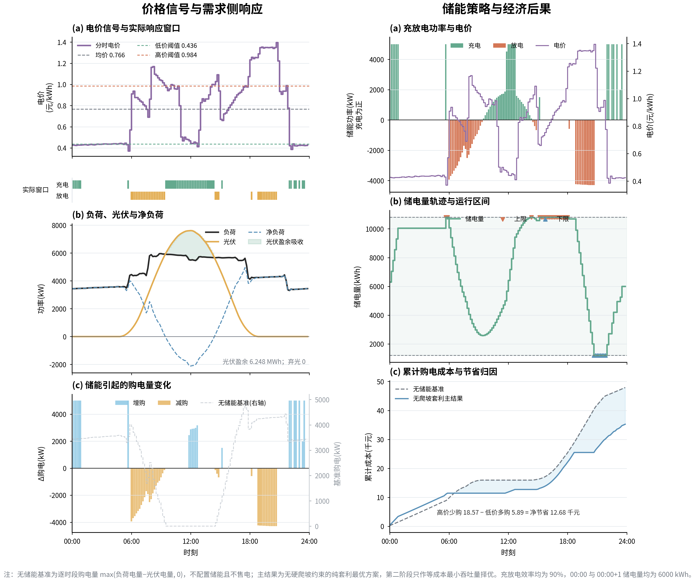
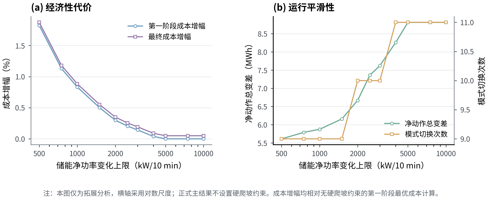

# 问题一：日前购电与储能调度的线性规划方案

## 1. 结论摘要

问题一正式结果采用两阶段词典序连续线性规划（LP）。第一阶段只寻求无硬爬坡约束下的最低购电成本；第二阶段把成本固定在第一阶段最优值的数值容差内，并最小化充放电总吞吐量，从等成本解中排除无效循环和同时充放电。储能硬爬坡三阶段模型仅作为拓展，不进入正式结果表和图1—图3的主情景。

统一时序口径为：附件1的电价是区间起点价格，负荷与光伏是区间终点状态。因此，任一购电区间使用“负荷/光伏记录前一行”的电价。例如：

- 00:00—00:10：使用附件1中“0:00+1”行的电价，满足“00:10”行的负荷/光伏；
- 00:10—00:20：使用“00:10”行的电价，满足“00:20”行的负荷/光伏；
- 23:50—00:00+1：使用“23:50”行的电价，满足“0:00+1”行的负荷/光伏。

储能状态按物理时间从 00:00 连续递推到 00:00+1，并强制

\[
E_{00:00}=6000\ \text{kWh},\qquad E_{00:00+1}=6000\ \text{kWh}.
\]

在这一口径下，正式主结果的购电费为 **35245.31 元**，较无储能基准 **47921.77 元**节省 **12676.47 元**，节省率为 **26.45%**。第二阶段与第一阶段的成本差仅为约 \(3.5\times10^{-6}\) 元，即求解器数值容差，不构成经济性让步。全程无弃光、无同时充放电，SOC 始终位于 1200—10800 kWh。

## 2. 数据时序与索引映射

### 2.1 物理时间语义

附件1首行数据是 00:10，末行是 0:00+1。负荷与光伏时刻表示前一10分钟区间的终点，电价时刻表示交易区间的起点；供需平衡据此在同一物理区间上连接计划购电、电价、负荷与光伏。

### 2.2 底层映射规则

令物理区间索引为 \(t=0,1,\ldots,143\)，对应区间 \([10t,10(t+1)]\) 分钟。原附件行索引记为 \(r=0,1,\ldots,143\)，依次对应 00:10、00:20、…、23:50、0:00+1。底层数据映射为

\[
r_t^{\text{price}}=(t-1)\bmod 144,\qquad r_t^{\text{demand}}=t,
\]

即

\[
\pi_t=\pi^{\rm raw}_{(t-1)\bmod144},\quad L_t=L^{\rm raw}_{t},\quad P_t=P^{\rm raw}_{t}.
\]

代码在输入表中显式保留 `delivery_interval`、`price_source_time_label`、`demand_source_time_label`、`result_row_index`，使每个决策区间的价格来源、需求来源和官方模板去向都可逐行追踪。

### 2.3 官方 result1.xlsx 的回填顺序

内部求解按 00:00—00:10、00:10—00:20、…、23:50—00:00+1 排列。官方模板首行是 00:10—00:20，末行是 00:00+1—00:10+1，因此写入模板前按 `result_row_index` 重新排序：内部 00:10—00:20 写入模板第 1 个数据行，内部 00:00—00:10 作为跨日同构区间写入模板第 144 个数据行。该重排只改变展示位置，不改变物理求解或 SOC 递推顺序。

## 3. 模型符号与单位

每个时段长度为 \(\Delta t=1/6\) h。模型中的流量变量均使用 kWh/10 min：

| 符号 | 含义 | 单位 |
|---|---|---|
| \(G_t\) | 外网购电量 | kWh/10 min |
| \(C_t\) | 储能充电侧电量 | kWh/10 min |
| \(D_t\) | 储能放电侧电量 | kWh/10 min |
| \(U_t\) | 弃光量 | kWh/10 min |
| \(E_t\) | 时段起点储电量 | kWh |
| \(\pi_t\) | 区间起点电价 | 元/kWh |
| \(L_t,P_t\) | 区间终点负荷、光伏折算电量 | kWh/10 min |

附件中的负荷与光伏为 kW，统一乘以 \(\Delta t\) 后进入约束。

## 4. 底层约束

### 4.1 区间供需平衡

\[
G_t+P_t+D_t=L_t+C_t+U_t,\qquad t=0,\ldots,143.
\]

这里的 \(\pi_t\) 来自负荷/光伏记录的前一行。该等式保证区间内微网提供的电量不低于区间终点对应的小区需求；若光伏有剩余，只能被储能吸收或形成弃光。

### 4.2 SOC 递推与首末闭环

充、放电效率均为 \(\eta_c=\eta_d=0.90\)：

\[
E_{t+1}=E_t+\eta_c C_t-\frac{D_t}{\eta_d},\qquad t=0,\ldots,143.
\]

\[
E_0=6000,\qquad E_{144}=6000.
\]

其中 \(E_0\) 对应 00:00，\(E_{144}\) 对应 00:00+1。实现中 `soc_start_kwh` 第一行和 `soc_end_kwh` 最后一行分别独立校验为 6000。

### 4.3 SOC 安全区间

\[
1200\le E_t\le10800,\qquad t=1,\ldots,144.
\]

### 4.4 充放电功率约束

最大充、放电功率均为 5000 kW，折算到 10 分钟电量为

\[
0\le C_t\le833.3333,\qquad 0\le D_t\le833.3333.
\]

### 4.5 购电与弃光边界

\[
G_t\ge0,\qquad 0\le U_t\le P_t.
\]

模型不允许售电；弃光量不能超过当期光伏发电量。

### 4.6 不设置硬爬坡约束

正式模型不包含

\[
|B_t-B_{t-1}|\le R_B\Delta t,\qquad B_t=C_t-D_t,
\]

也不对 \(G_t\) 设置相邻时段变化上限。题面没有提供储能变流器或并网点的真实爬坡参数，将任意数值写入主模型会引入额外工程假设。正式主结果不追求动作平滑，仅寻求套利最优并消除无效充放电循环。

## 5. 主结果的两阶段词典序目标

### 5.1 第一阶段：最低购电成本

\[
C_1^*=\min \sum_{t=0}^{143}\pi_tG_t.
\]

第一阶段只包含题面给定的能量平衡、充放电功率、SOC、首末闭环与非负约束，不包含硬爬坡约束。

### 5.2 第二阶段：等成本最小吞吐量

在购电成本保持第一阶段最优的条件下，求

\[
\min\sum_t(C_t+D_t).
\]

成本约束为

\[
\sum_t\pi_tG_t\le C_1^*+\varepsilon_{\rm num},
\]

其中 \(\varepsilon_{\rm num}\) 仅为约 \(10^{-10}C_1^*\) 的求解器数值容差，不是 0.05% 成本裕度。第二阶段不改变套利目标，只在经济等价解中选择吞吐量最小的方案。由于充放电效率小于 1，无效同时充放电会增加吞吐量，因此被该目标排除。最终仍以逐时段检查作为验收条件，无需引入 0-1 变量。

## 6. 实施流程

1. 读取附件1并验证 144 行、4 列、表头时序、有限值与非负性；
2. 按物理区间重构价格与负荷/光伏索引；
3. 把 kW 转换为 kWh/10 min；
4. 构建供需平衡、SOC 递推、首末状态、变量边界；
5. 用 HiGHS 依次求解主结果的两个连续 LP；
6. 计算无储能基准、四小时汇总、指定时刻结果和对偶量；
7. 校验平衡残差、SOC 递推、边界、首末 SOC、同时充放电和等成本约束；
8. 输出 CSV、JSON、中文论文图，并按官方模板顺序回填 `result1.xlsx`；
9. 单独运行硬爬坡三阶段模型及储能爬坡率敏感性分析，作为拓展结果。

## 7. 正式主结果

### 7.1 核心指标

| 指标 | 数值 |
|---|---:|
| 无储能基准购电量 | 61789.9354 kWh |
| 无储能基准购电费 | 47921.7741 元 |
| 第一阶段最低购电费 | 35245.3072 元 |
| 两阶段正式购电费 | 35245.3072 元 |
| 相对第一阶段差额 | 0.0000035 元（仅数值容差） |
| 相对无储能基准节省 | 12676.4668 元 |
| 相对无储能基准节省率 | 26.4524% |
| 总购电量 | 59352.2408 kWh |
| 总充电量 | 20054.0439 kWh |
| 总放电量 | 16243.7755 kWh |
| 总弃光量 | 0 kWh |
| SOC 范围 | 1200—10800 kWh |
| 00:00 / 00:00+1 SOC | 6000 / 6000 kWh |
| 同时充放电时段数 | 0 |

### 7.2 四小时充放电汇总

| 时段 | 充电量（kWh） | 放电量（kWh） |
|---|---:|---:|
| 0:00—4:00 | 4500.0000 | 0.0000 |
| 4:00—8:00 | 833.3333 | 5697.5873 |
| 8:00—12:00 | 3434.1779 | 1702.9970 |
| 12:00—16:00 | 5953.1993 | 203.1913 |
| 16:00—20:00 | 0.0000 | 5064.2630 |
| 20:00—24:00 | 5333.3333 | 3575.7370 |

### 7.3 指定时刻购电量

表中的时刻是购电区间起点。例如 10:00 对应 10:00—10:10，其负荷/光伏取附件1的 10:10 行。

| 区间起点 | 购电量（kWh/10 min） |
|---|---:|
| 10:00 | 0.0000 |
| 12:00 | 480.4125 |
| 14:00 | 0.0000 |
| 16:00 | 445.4317 |
| 18:00 | 641.1613 |
| 20:00 | 0.0000 |

## 8. 图表解读

### 8.1 图1：价格信号与需求侧响应

图1按“机会在哪里—需求是多少—最终买了多少”的逻辑组织：(a) 展示电价、低/高价阈值及实际充放电窗口；(b) 展示负荷、光伏、净负荷和被储能吸收的光伏盈余，本方案弃光为 0；(c) 以“最优购电−无储能基准购电”的柱状差异突出增购与减购发生的时段。

### 8.2 图2：储能策略与经济后果

图2按“储能怎么动—库存如何变化—最终节省多少”的逻辑组织：(a) 对照充放电功率与电价；(b) 展示 SOC 轨迹、安全运行带与触界时段；(c) 比较累计购电成本并拆分高价少购收益与低价增购成本。

### 8.3 图3：调度机制的对偶解释

图3回答“为什么这样调度”：(a) 对照外网电价 \(\pi\)、功率平衡影子价格 \(\lambda_{balance}\)、储能水价值 \(\lambda_{water}\)，并给出 \(\pi/\eta\) 与 \(\eta\pi\) 两条理论边界；(b) 仅展示正式模型中真实存在的 SOC 上、下限影子价格强度。由于主模型没有硬爬坡约束，图中不再绘制爬坡触界。

### 8.4 Word 双栏全图

## 9. 拓展：储能硬爬坡率敏感性分析

本节不是正式主结果。拓展模型恢复原三阶段结构：第一阶段附加硬爬坡约束 \(|B_t-B_{t-1}|\le R_B\Delta t\) 并最小化成本；第二阶段允许成本在第一阶段基础上增加不超过 0.05%，最小化循环总变差；第三阶段保持总变差并最小化吞吐量。部分情景如下：

| \(R_B\)（kW/10 min） | 第一阶段成本增幅 | 最终成本增幅 | 净动作总变差（MWh） | 模式切换数 |
|---:|---:|---:|---:|---:|
| 500 | 1.8219% | 1.8728% | 5.612 | 9 |
| 1000 | 0.8333% | 0.8837% | 5.875 | 9 |
| 1500 | 0.5020% | 0.5522% | 6.158 | 9 |
| 2000 | 0.2994% | 0.3495% | 6.669 | 10 |
| 3000 | 0.1432% | 0.1932% | 7.624 | 10 |
| 4000 | 0.0397% | 0.0897% | 8.261 | 11 |
| 5000 | 0.0000% | 0.0500% | 8.813 | 11 |

越严格的硬爬坡约束越能降低动作总变差，但会增加购电成本。5000 kW/10 min 及以上在本数据下已不约束第一阶段经济最优解。由于题面未给出真实 \(R_B\)，这些数值只能作为拓展情景，不能作为正式主模型的既定参数。

## 10. 质量检查与可复现输出

自动检查结果为 PASS：144 个物理区间完整；第一行 00:00—00:10 的价格来源为 0:00+1、负荷/光伏来源为 00:10；第二行 00:10—00:20 的价格来源为 00:10、负荷/光伏来源为 00:20；供需平衡最大残差约 \(1.14\times10^{-13}\) kWh，SOC 递推最大残差约 \(9.09\times10^{-13}\) kWh；00:00 初始与 00:00+1 终止 SOC 均为 6000 kWh；无 SOC 越界、无同时充放电、无负购电、无负弃光；正式模型的 `model_variant=formal_main_no_ramp_pure_arbitrage`、`hard_battery_ramp_constraint_active=false`。

| 文件 | 内容 |
|---|---|
| `outputs/question1/result1.xlsx` | 官方模板格式正式结果 |
| `outputs/question1/question1_schedule.csv` | 物理时间顺序的逐时段调度与来源映射 |
| `outputs/question1/question1_summary.json` | 汇总指标、求解器状态与质量检查 |
| `outputs/question1/question1_battery_ramp_sensitivity.csv` | 拓展爬坡率敏感性数据 |
| `outputs/question1/figures/` | 中文论文级主结果图与拓展图 |

## 11. 最终结论

问题一模型统一采用“区间起点电价—区间终点负荷/光伏”的时序关系，并把储能日循环严格锚定在 00:00 与 00:00+1 的 6000 kWh。正式结果只寻求无硬爬坡约束下的套利最优；第二阶段在数值等成本条件下最小化吞吐量，以排除无效同时充放电。硬爬坡、0.05%成本裕度、总变差平滑和最小吞吐量组成的三阶段模型保留为工程拓展。
