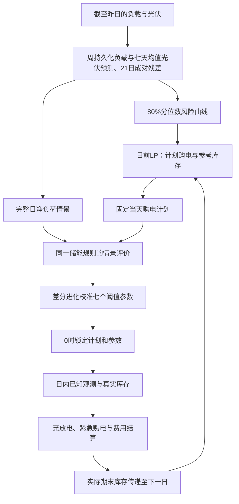

# 问题二：基于80%分位数风险修正与截断仿射储能规则的微网购电策略

## 摘要

针对固定电价下负载和光伏逐日变化、计划购电全天锁定而供电缺口须按五倍电价紧急补购的问题，建立“风险修正日前计划—同规则情景校准—日内因果执行”的分层优化模型。首先，利用负载的周内日型结构以周持久化预测负载、以最近七天同一时段均值预测光伏，利用最近21个有效历史日的成对残差构造净负荷情景；依据单时段购电的成本权衡，固定80%分位数形成风险修正曲线，并通过线性规划确定计划购电量及参考库存。其次，将全天划分为四个六小时阶段，以阶段开始前的累计预测误差均值为反馈信息，构造截断仿射库存保留阈值，采用有限预算差分进化算法每日校准七个参数。日前情景评价与日内运行共用充放电规则，在不改变当天购电计划的条件下，保证设备可行性和信息非预见性。最后，2025-01-01 作为冻结初始条件日（无计划、电池不动作、SOC 恒 6000 kWh、不进入统计），从1月2日6000 kWh库存出发连续仿真，得到2—12月实际总购电费13,978,077.23元，其中计划费13,332,849.50元、紧急费645,227.73元；相比分位数固定保留基线和即时补缺基线分别节费187,109.73元和64,758.83元。逐时供需平衡、库存递推、跨日连续及结果表回读检查均通过。在固定数据口径、当前参数边界与搜索预算以及已完成的四种策略对照范围内，LDR取得最低正式期总费，因此作为问题二主方案。本文将此结论表述为“当前配置下最优”，不扩展为所有预测与控制策略的全局最优；相似日高斯核暂未接入本轮费用回测，不在该结论范围内。

**关键词：** 微网调度；风险分位数；储能控制；仿射决策规则；差分进化；因果回测

## 1 问题分析与建模思路

问题二与单日确定性调度的区别，在于每天0:00只能根据历史数据确定购电计划，实际负载和光伏随后才逐时段揭示。计划电量买多后不能退款，买少则需以当时电价的五倍补购；储能既可利用低价电和光伏富余，也可在实际偏差出现后降低紧急购电费用。因此，目标不是单纯提高点预测精度或减少紧急购电量，而是在预测不确定性和储能时序约束下，使真实结算费用尽可能低。

模型需同时解决三个问题：一是确定计划购电应预留多少风险余量；二是决定实际缺口发生时电池应立即放电还是保留给后续时段；三是保证制定策略时未使用未来实际数据。仅在平均预测曲线上优化容易低估五倍补购的代价；直接维持预测条件下的规划库存，又可能在当前仍有可用电量时发生不必要的高价补购。

据此，采用分层结构：第一层在80%风险分位数曲线上制定计划；第二层固定该计划，在历史情景上校准储能保留规则；第三层使用真实已知信息执行同一规则。仿射反馈调整库存保留程度，但不修改日内购电计划。本模型属于**风险修正确定性规划与经验情景控制相结合的近似优化方法**，不是直接联合求解所有未来信息状态的多阶段随机规划。



## 2 模型假设、数据口径与符号

### 2.1 模型假设

1. 每天划分为144个10分钟区间，负载、光伏和储能以区间电量表示；固定电价由附件1给出。
2. 每天0:00确定全部普通购电计划，日内不调整，普通购电按计划全额计费；未利用电量不退款、不向外网出售。0:00 计划只覆盖当日 00:00—24:00 的 144 个区间，不包含次日 00:00+ 的任何购电；结果模板末列“0:00-0:10+1”仅为展示映射（见附录B），12/31 末列填 0。
3. 储能在当前区间跟随实际供需响应，当前区间之后的实际数据不可用于决策。此为离散实时响应假设，不表示区间开始前已准确知道整个区间电量。
4. 充电与放电效率各取90%，往返效率为81%；不另计题面未给出的自放电、容量衰减和循环成本。
5. 不额外设置储能硬爬坡约束或紧急购电功率上限；储能受题定容量和充放电功率约束。
6. 采用富余才充电、缺口才放电的运行规则，不为充电额外紧急购电。允许未利用供能，不能把该量全部称为弃光量。
7. 跨日继承实际库存，不把问题一的日初日末相等约束移植到问题二。

### 2.2 数据与时间对齐

只使用附件1固定电价、附件2负载和光伏实际数据，以及附件5结果模板；问题二不引入附件3滚动预报或附件4波动电价。附件2包含365天、每天144个观测。功率转区间电量为

$$
L_{d,t}=P^L_{d,t}\Delta t,\qquad V_{d,t}=P^V_{d,t}\Delta t,\qquad \Delta t=\frac16\ \mathrm h.
\tag{1}
$$

沿用统一预处理口径：负载与光伏标签作为前一10分钟区间的终点，电价标签作为区间起点；日循环电价移位后与物理区间对齐，00:00起点使用该周期末行对应电价。时间对齐属于模型的数据解释，应与问题一及其他问题保持一致。模型内部区间始终按当天00:00—24:00排序，结果模板跨日末列在导出时独立映射，见附录B。

### 2.3 主要符号

| 符号 | 含义 | 单位或取值 |
|---|---|---|
| $d,t$ | 日期、日内区间序号 | $t=1,\ldots,144$ |
| $L_{d,t},V_{d,t},N_{d,t}$ | 负载、光伏、净负荷电量 | kWh，$N=L-V$ |
| $\widehat L,\widehat V,\widehat N$ | 日前点预测 | kWh |
| $\widetilde N$ | 风险修正规划净负荷 | kWh |
| $c_t$ | 普通购电电价 | 元/kWh |
| $g_{d,t},b_{d,t}$ | 计划购电、紧急购电量 | kWh |
| $C_{d,t},D_{d,t},U_{d,t}$ | 交流侧充电、放电、未利用供能 | kWh |
| $E_{d,t}$ | 第$t$区间末内部库存 | kWh |
| $E^{p}_{d,t}$ | 日前LP参考库存 | kWh |
| $R_{d,t}$ | 放电保留阈值 | kWh |
| $\eta$ | 单向充放电效率 | 0.9 |
| $E_{\min},E_{\max}$ | 内部库存上下界 | 1200、10800 kWh |
| $S$ | 单区间充放电电量上限 | $5000/6=833.333333$ kWh |
| $\alpha$ | 风险分位水平 | 固定0.8 |
| $a_{d,k}$ | 第$k$阶段开始前的平均净负荷预测误差 | kWh |
| $\delta_{d,k},\lambda_{d,k}$ | 阈值截距修正、误差反馈系数 | kWh、无量纲 |
| $\nu$ | 单位内部期末库存价值代理 | $\min_t c_t/\eta=0.41255556$元/kWh |

以下推导在不引起歧义时略去日期下标$d$。

## 3 预测、残差情景与80%风险设计

### 3.1 负载周持久化与光伏七天同区间均值预测

附件2显示小区负载具有稳定的周内日型结构：周五、周六的日均负载显著低于周一至周四与周日，且该差异逐月、逐假期成立。据此，对决策日$d$的负载采用周持久化，即直接复用七天前同一日型的完整144点曲线；光伏天气波动较快，采用最近七天同一时段均值平滑：

$$
\widehat L_{d,t}=L_{d-7,t},\qquad
\widehat V_{d,t}=\frac17\sum_{i=1}^7V_{d-i,t},\qquad
\widehat N_{d,t}=\widehat L_{d,t}-\widehat V_{d,t}.
\tag{2}
$$

1月2日至7日尚无完整一周前历史，负载预测退化为昨日持久化 $\widehat L_{d,t}=L_{d-1,t}$（仅预热期，不使用附件1）；光伏在历史不足七天时使用已有历史均值，1月8日起使用完整七天窗口。两种方法均只用决策日前已完成日的数据，参数少、可逐日更新，且不引入日型混合偏差。

### 3.2 保持同日配对的历史残差情景

对历史日$i$，使用该日当时可获得的预测计算残差：

$$
\varepsilon^L_{i,t}=L_{i,t}-\widehat L_{i,t},\qquad
\varepsilon^V_{i,t}=V_{i,t}-\widehat V_{i,t}.
\tag{3}
$$

取决策日前最近$M=21$个有效完整残差日，负载、光伏残差保持同日配对，构造

$$
N_{d,t,\omega}=
\left[\widehat L_{d,t}+\varepsilon^L_{i_\omega,t}\right]^+
-\left[\widehat V_{d,t}+\varepsilon^V_{i_\omega,t}\right]^+,
\qquad p_\omega=\frac1M,
\tag{4}
$$

其中$[x]^+=\max(x,0)$。对负载和光伏分别截断可避免生成负功率；按完整日路径取样，保留样本中的日内相关性及同日负载—光伏配对关系。历史预测必须只用其自身当时可获得的数据（负载为七天前同日曲线、光伏为此前七天均值），不能用决策日重新拟合的残差替换历史样本外残差。

### 3.3 固定80%分位数的经济依据

先忽略储能，在单时段考虑计划采购$g\ge0$，未用电量没有残值，则

$$
\min_{g\ge0}F(g)=cg+5c\,\mathbb E[(N-g)^+].
\tag{5}
$$

若净负荷分布在最优点连续，内部解满足

$$
F'(g)=c-5c\,\mathbb P(N>g)=0,
\qquad \mathbb P(N\le g)=0.8.
\tag{6}
$$

因此，80%分位数对应正常采购与五倍补购的成本平衡。离散分布采用分位数的次梯度条件；若分位数为负，则还需满足$g\ge0$的可行域约束。

将该经济依据作为完整模型预先固定的风险设计，取

$$
\widetilde N_{d,t}=
\max\left\{\widehat N_{d,t},\;Q_{0.8}(N_{d,t,1},\ldots,N_{d,t,M})\right\}.
\tag{7}
$$

最大值保护使规划净需求不低于点预测；经验分位数沿用线性插值数值口径。必须区分：式(6)是简化单时段模型的结论，式(7)在加入储能耦合后是一种风险修正设计，不是完整系统最优性定理，也不代表全天80%的可靠性约束。分位水平固定0.8，不依据全年事后扫描重新选择。

## 4 日前计划购电与参考库存模型

### 4.1 目标函数

以风险修正曲线$\widetilde N_t$为输入，联合确定当天计划购电、参考充放电和库存：

$$
\min J^{\mathrm{LP}}=
\sum_{t=1}^{T}c_tg_t-\nu E_T^p,
\qquad \nu=\frac{\min_t c_t}{\eta}.
\tag{8}
$$

期末项近似表示保留内部电量的替代购电价值，减轻单日截断造成的“只顾当日耗尽电池”。它不是精确跨日价值函数，也不形成真实退款或收入。

### 4.2 供需平衡和储能约束

$$
g_t+D_t^p=\widetilde N_t+C_t^p+U_t^p,
\tag{9}
$$

$$
E_t^p=E_{t-1}^p+\eta C_t^p-\frac{D_t^p}{\eta},
\quad E_0^p=E_{d-1,T}^{\mathrm{act}},
\tag{10}
$$

$$
E_{\min}\le E_t^p\le E_{\max},\quad
0\le C_t^p,D_t^p\le S,\quad g_t,U_t^p\ge0.
\tag{11}
$$

式(9)中的$U_t^p$吸收不能利用的富余供能，保证净负荷为负或库存已满时仍能表达可行状态。问题二不强制$E_T^p=E_0^p$，跨日衔接使用实际执行结果。

### 4.3 词典序求解与输出

每日LP约有720个连续变量。第一阶段最小化式(8)；第二阶段将第一阶段目标限制在最优值加$10^{-6}$元的容差内，再最小化

$$
\sum_{t=1}^{T}(C_t^p+D_t^p).
\tag{12}
$$

该步骤用于消除等成本退化解中的无效充放电；当前实例进一步逐时核验充放电互斥与平衡。两阶段均采用HiGHS线性规划求解器。

得到计划$g_t^Q$与参考库存$E_t^p$。当天$g_t^Q$随后锁定，LDR校准不重新优化它；但下一日会依据上一日实际库存重新生成计划，因此不同控制策略长期运行下的购电计划不必相同。

## 5 截断仿射保留阈值与日内统一规则

### 5.1 从固定保留到自适应保留

固定保留基线为$R_t=E_{\min}+\beta(E_t^p-E_{\min})$。当$\beta=0$时，储能在允许范围内尽量即时补缺；当$\beta=1$时，保留到参考库存。参考轨迹并不是实际电量未来价值的精确估计，因此固定$\beta=1$可能过度保留，而固定$\beta=0$可能在低价时过早用尽电量。

为让保留决策随实际偏差变化，划分四个阶段$k=1,2,3,4$，分别对应0—6、6—12、12—18、18—24时。令阶段开始前已完成区间数为$m_k\in\{0,36,72,108\}$，定义

$$
a_{d,1}=0,\qquad
a_{d,k}=\frac1{m_k}\sum_{s=1}^{m_k}(N_{d,s}^{\mathrm{obs}}-\widehat N_{d,s}),\quad k\ge2.
\tag{13}
$$

每个阶段只在开始时更新该统计量，阶段内保持固定。其数值是此前全部完成区间的平均误差，不是仅上一阶段的误差，也不包含尚未执行区间。

### 5.2 截断仿射阈值

定义

$$
R_{d,t}=\operatorname{clip}\left(
E_{d,t}^p+\delta_{d,k(t)}+\lambda_{d,k(t)}a_{d,k(t)},
E_{\min},E_{\max}\right),
\tag{14}
$$

$$
\operatorname{clip}(x,l,u)=\min\{u,\max(l,x)\}.
$$

每天校准四个$\delta$和三个有效$\lambda$，第一阶段$\lambda_{d,1}=0$。实现中参数范围固定为

$$
-9600\le\delta_{d,k}\le9600,\qquad
-2\le\lambda_{d,k}\le2\quad(k=2,3,4).
\tag{15}
$$

所有参数在当天0:00锁定。$\delta$改变阶段保留水平，$\lambda$调节对历史偏差的响应；系数可正可负，由历史情景费用决定，不能预设其符号必然具有某种经济效果。截断保证即使当天误差超出历史范围，保留阈值仍不越界。

零参数对应原$\beta=1$规则；所有$\delta=-9600$且$\lambda=0$经过截断对应$\beta=0$。因此两种基线均可由规则族表达，但**当前实现仅显式以零参数作为搜索保底，未显式同时以$\beta=0$保底**。本结果不另外叠加一个自由$\beta$参数。

### 5.3 统一充放电与紧急购电规则

设区间实际净缺口为

$$
r_{d,t}=N_{d,t}^{\mathrm{obs}}-g_{d,t}^Q,
\tag{16}
$$

给定上一区间库存$e=E_{d,t-1}^{\mathrm{act}}$，计算

$$
C_{d,t}^{\mathrm{act}}=
\min\left\{(-r_{d,t})^+,\;S,\;\frac{E_{\max}-e}{\eta}\right\},
\tag{17}
$$

$$
D_{d,t}^{\mathrm{act}}=
\min\left\{r_{d,t}^+,\;S,\;\eta(e-R_{d,t})^+\right\},
\tag{18}
$$

$$
b_{d,t}=r_{d,t}^+-D_{d,t}^{\mathrm{act}},\qquad
U_{d,t}=(-r_{d,t})^+-C_{d,t}^{\mathrm{act}},
\tag{19}
$$

$$
E_{d,t}^{\mathrm{act}}=e+\eta C_{d,t}^{\mathrm{act}}
-\frac{D_{d,t}^{\mathrm{act}}}{\eta}.
\tag{20}
$$

紧急购电只补充放电后仍存在的缺口。式(14)、(17)—(20)共同构成实际控制器。只有阈值的未截断部分是仿射形式，整个控制器含正部、最小值和截断，是分段非线性规则；本文将其简称为LDR控制，不把全部动作称为纯线性决策。

### 5.4 物理可行性与非预见性

**物理可行性。**当$r_t<0$时，式(18)给出$D_t=0$，式(17)保证充电不超过富余供能、功率界和剩余容量；当$r_t>0$时，式(17)给出$C_t=0$，且$R_t\ge E_{\min}$使放电不超过最低库存以上的可用电量。两种情形均有$b_t,U_t\ge0$，并满足

$$
g_t^Q+V_t+D_t+b_t=L_t+C_t+U_t.
\tag{21}
$$

由此逐时保证供电满足负载、充放电互斥、库存与功率可行，并且不会一边紧急购电一边充电。保留阈值是放电停止参考，不是必须充到的硬目标；库存低于阈值时不强制补购充电。

**信息非预见性。**$g^Q,E^p,\delta,\lambda$由日前历史决定；$a_k$只依赖阶段开始前的已完成观测；每次动作只需当前供需和现有库存。因此，只要两个输入路径在当前以前的信息相同，其此前动作也相同。6、12、18时更新的是本地已观测误差信号，不是使用附件3新预报，也不调整普通购电计划，仍属于问题二信息条件。

## 6 日前情景校准及有限预算求解

### 6.1 同一规则下的经验目标

固定当天$g^Q,E^p$和实际日初库存。对每条历史情景，从相同日初库存出发，按式(13)—(20)顺序推演，得到$b_{t,\omega}(\theta)$和$E_{T,\omega}(\theta)$。其中

$$
\theta=(\delta_1,\delta_2,\delta_3,\delta_4,\lambda_2,\lambda_3,\lambda_4).
$$

每日求解

$$
\min_{\theta\in\Theta}\widehat J_d(\theta\mid g^Q)
=\sum_t c_tg_t^Q+
\frac1M\sum_{\omega=1}^{M}
\left[\sum_t5c_tb_{t,\omega}(\theta)-\nu E_{T,\omega}(\theta)\right].
\tag{22}
$$

第一项在固定计划下是常数，实际参数搜索只计算后两项。该层按经验平均成本优化，没有额外CVaR权重；它与第一层80%分位数风险修正各司其职。

情景内未来曲线只能用于评价一个候选共享参数策略，不能让某时段动作直接读取该情景后续值。通过显式执行同一个映射，避免把各情景自由选择的完美未来储能动作当成真实可执行追索。

这里的“日前—日内一致”指：在同一输入路径、参数、购电计划和初始库存下，情景评价与实际执行完全一致。它不指实际路径等于预测路径，也不指第一层分位数LP已经等价于真实期望总费用的联合最小化。

### 6.2 差分进化搜索

式(22)包含截断和最小值操作，采用七维有界直接搜索。当前实现配置如下。

| 项目 | 实际采用设置 |
|---|---|
| 算法 | 差分进化，`best1bin` |
| 维度与边界 | 7维；4个截距修正、3个反馈系数；见式(15) |
| 种群系数 | 5，七维问题通常对应35个个体 |
| 最大迭代预算 | 8代 |
| 初始化 | 拉丁超立方；显式加入零参数 |
| 变异因子 | 0.5—1.0 |
| 重组概率 | 0.7 |
| 随机种子 | 20250912加日期的零基序号 |
| 计算方式 | 情景与候选参数向量化，单工作进程，无末端局部精修 |
| 接受规则 | 候选经验目标不高于零参数目标加$10^{-8}$；否则回退零参数 |

上述配置固定用于此次全年运行，不能因真实当天或全年费用重新选择当天参数。当前实现只给出预算内找到的候选，不证明七维经验目标全局最优。在337个完整残差窗日期中，324天达到最大迭代预算，13天满足算法终止条件；达到预算后仍可接受物理可行且满足基线检查的候选。不能将“被接受”写成“全局收敛”。

## 7 初始化、连续仿真与费用结算

### 7.1 初始化

2025-01-01 为冻结初始条件日：无购电计划、电池不动作、SOC 恒 6000 kWh、不进入任何统计；首个计划日为 1/2，当天从 6000 kWh 起步。1月2—7日负载退化为昨日持久化 L_{d-1}、光伏使用已有历史均值；1月8日起负载使用周持久化、光伏使用完整七天均值；只将完整预测窗口产生的残差纳入正式残差池。1月9—28日逐渐积累残差，1月29日起可用完整21条。

完整残差窗建立前，LDR参数为零；1月29日起逐日校准。全年共有337个校准日，其中2—12月334天构成正式结果期。2月1日库存继承1月31日真实执行结果，不人为重置。

### 7.2 每日求解步骤

**输入：**截至前一日的实际数据、当日固定电价、真实日初库存。

1. 计算负载周持久化与光伏七天均值点预测及过去有效残差，构造21条情景和80%风险曲线。
2. 求解日前两阶段LP，得到$g^Q$和$E^p$。
3. 在同一日初库存下计算零参数经验目标，进行有限预算差分进化，得到并检查当天参数$\theta_d$。
4. 锁定$g^Q$和$\theta_d$；日内每个阶段开始时更新$a_k$，逐区间执行式(17)—(20)。
5. 记录购电、充放电、未利用供能和真实库存；将日末真实库存传递至下一日。

### 7.3 实际账单与输出

正式期实际总费用为

$$
C_{\mathrm{actual}}=
\sum_{d\in\mathcal D}\sum_{t=1}^{144}
\left(c_tg_{d,t}^Q+5c_tb_{d,t}\right),
\quad \mathcal D=\{2025\text{-}02\text{-}01,\ldots,2025\text{-}12\text{-}31\}.
\tag{23}
$$

期末价值不进入真实账单。全年1—12月账本用于验证初始化和跨日连续性；正式期334天、48096个区间用于题目结果表和方案比较。最终完整结果保存为LDR方案的`result2.xlsx`，与旧方案文件分目录保存。

## 8 计算结果与方案比较

### 8.1 正式期总体结果

| 指标 | 数值 | 单位 |
|---|---|---|
| 计划购电量 | 21,648,740.95 | kWh |
| 计划购电费 | 13,332,849.50 | 元 |
| 紧急购电量 | 129,705.32 | kWh |
| 紧急购电费 | 645,227.73 | 元 |
| 实际总费 | 13,978,077.23 | 元 |
| 充电总量 | 6,209,054.42 | kWh |
| 放电总量 | 5,029,906.37 | kWh |
| 未利用供能 | 2,660,108.73 | kWh |
| 2月1日0时库存 | 2,263.21 | kWh |
| 12月31日24时库存 | 1,627.33 | kWh |

正式期136天发生紧急购电，198天无紧急购电；共1556个10分钟区间发生紧急补购。发生紧急购电并不意味着负载未被满足，式(19)已补齐剩余缺口。不能把“无紧急购电天数比例”称为供电可靠率。

全年1月2日—12月31日（364 天）实际费用为15,749,745.67元，为1月2日—1月31日预热与2—12月正式期的连续账本（1月1日冻结、无任何费用与动作）；不能与其他策略2—12月费用直接排名。此次全年运行记录约101.94秒，其中日前LP约20.20秒、参数校准约80.68秒；该时间不含全部文件读取、Excel导出和论文图表生成，也不是其他硬件上的保证。

### 8.2 独立连续运行的策略对照

2025-01-01 为冻结初始条件日（无计划、电池不动作、SOC 恒 6000 kWh、不入统计），四种策略均从1月2日6000 kWh连续运行。分位数β=1、β=0和LDR使用相同的风险曲线生成方法；LDR日内库存不同，后续日期的计划随之变化。情景价值方案使用另一套日前情景规划，因此只作为整套策略比较。

| 方案 | 计划费／元 | 紧急费／元 | 实际总费／元 | 紧急电量／kWh |
|---|---|---|---|---|
| 分位数＋β=1 | 13,326,707.15 | 838,479.81 | 14,165,186.96 | 187,104.90 |
| 分位数＋β=0 | 13,333,371.39 | 709,464.67 | 14,042,836.06 | 123,759.74 |
| 情景价值控制 | 12,984,091.15 | 999,128.15 | 13,983,219.29 | 192,142.96 |
| 分位数＋LDR | 13,332,849.50 | 645,227.73 | 13,978,077.23 | 129,705.32 |

相对β=1，LDR总费减少187,109.73元，约1.3209%；相对β=0减少64,758.83元，约0.4612%；相对情景价值控制减少5,142.06元，约0.0368%。分位数三方案的正式期期初库存：LDR与β=0同为2,263.206580 kWh、β=1为2,306.451024 kWh，年末均为1,627.326212 kWh，费用比较不依靠更少的期末存量。情景方案期初库存为1,738.000256 kWh、年末为1,315.278986 kWh，其边界差异随结果披露，不虚构库存退款。


图1数据来自各策略正式期汇总，柱形从零开始；总费差异相对总规模较小，紧急费分图进一步显示费用构成变化。本文所称“当前配置下最优”依据三层证据：第一，在相同题目数据、固定电价、2—12月正式期和既定参数配置下，LDR的实际总费低于表中的β=1、β=0与情景价值控制三种已完成对照；第二，同计划、同日初库存的配对回放仍显示LDR累计费用低于两种固定保留规则；第三，LDR及其对照均按各自策略连续运行，并通过物理可行性、因果信息、费用复算和结果表回读检查。该结论只是在当前数据口径、参数边界、搜索预算和已实现策略集合内的费用排序；其中相对情景价值控制的优势仅5,142.06元（约0.0368%）。相似日高斯核目前只完成预测精度比较，按本轮方案暂不接入问题二费用回测，因此不属于该排序的候选集合。上述证据支持选择LDR为主方案，但不构成对所有预测模型、参数配置和控制策略的全局最优性证明。

### 8.3 为什么紧急购电量略高，费用仍可更低

LDR相对β=0的紧急购电量增加5,945.58 kWh，但紧急费减少64,236.94元；计划费同时减少521.89元，合计节费64,758.83元。紧急电量与紧急费用的关系为

$$
C_b=\sum_t5c_tb_t=\overline c_b\sum_tb_t,
\qquad \overline c_b=\frac{\sum_t5c_tb_t}{\sum_tb_t}.
\tag{24}
$$

| 方案 | 紧急购电量／kWh | 紧急购电加权单价／元每kWh |
|---|---|---|
| 分位数＋β=1 | 187,104.90 | 4.4813 |
| 分位数＋β=0 | 123,759.74 | 5.7326 |
| 情景价值控制 | 192,142.96 | 5.1999 |
| 分位数＋LDR | 129,705.32 | 4.9746 |

LDR较低的紧急购电加权单价表明，费用优势与紧急购电时序有关，而非单纯减少补购总量。其机制是在低价缺口出现时可以保留部分电量，使电池在后续高价缺口中发挥更大作用。该解释与计算结果相符，但不能仅凭总体数字识别每个参数的独立因果贡献。

### 8.4 同计划、同日初库存的控制器配对

为区分计划变化和执行规则的影响，使用LDR每一天的同一购电计划与同一日初库存，分别执行LDR、β=1和β=0。

| 控制器 | 相同计划费／元 | 紧急费合计／元 | 配对费用合计／元 |
|---|---|---|---|
| LDR | 13,332,849.50 | 645,227.73 | 13,978,077.23 |
| β=1 | 13,332,849.50 | 838,590.87 | 14,171,440.37 |
| β=0 | 13,332,849.50 | 709,464.68 | 14,042,314.18 |

正式期LDR相对两种固定规则的配对累计费用分别减少193,363.14元和64,236.94元。相对β=0，LDR在35天费用更低、25天更高，其余274天持平。因此，不能宣称每天都改善；总费改善来自不同日期收益与损失的合计。配对试验逐日对齐库存，其累计结果不是三种策略各自连续运行的年度账单，也不允许按真实当天结果事后选择较优规则。


图2上图为LDR真实月度账单，下图为同计划配对试验按月累计的差额，二者统计含义不同。正式期各月的配对累计差额为正，但这不等价于各日都为正。6月1日单日紧急费为65,899.14元，为正式期最高，说明少数不利日期仍会显著影响风险成本。

### 8.5 与完美信息下界的比较

将正式期全部实际供需视为预先已知，并匹配LDR的2月1日库存2,263.206580 kWh，可求解同起始库存的匹配完美信息下界12,252,398.36元。该下界允许计划与储能全时域联合优化，且年末仅保留1200 kWh；实际LDR年末库存略高。

LDR实际费用与该下界相差1,725,678.87元。该差额占LDR实际费用的12.35%；若以下界为比较基准，则LDR实际费用比下界高14.08%。前者描述实际费用中高于理想下界的份额，后者描述相对于下界的超额比例，两者分母不同。该差额混合了信息不确定性、风险修正、分层近似、有限搜索和边界处理等影响，不能全部归因为预测误差，不能称为不可约成本，也不能认为更换控制器就可以全部消除。该下界只作为性能参考，不是可执行策略。

## 9 四个指定日期的购电与储能结果

### 9.1 指定日期费用与电量汇总

| 日期 | 计划购电量／kWh | 计划费／元 | 紧急电量／kWh | 紧急费／元 | 实际总费／元 |
|---|---|---|---|---|---|
| 2025-03-20 | 69,766.539847 | 42,448.79 | 0.000000 | 0.00 | 42,448.79 |
| 2025-06-21 | 39,436.411305 | 24,285.59 | 0.000000 | 0.00 | 24,285.59 |
| 2025-09-23 | 70,676.415695 | 43,933.99 | 74.796817 | 285.24 | 44,219.23 |
| 2025-12-21 | 101,561.567062 | 65,638.69 | 0.000000 | 0.00 | 65,638.69 |

下列各表按题目表1、表2的字段列示四日结果。购电、充放电及库存单位均为kWh，费用单位为元。正文电量保留六位小数、费用保留两位；完整结果仍按计算精度保存，显示值相加可能产生末位舍入差异。

### 9.2 2025-03-20 调度结果

**表：2025-03-20 指定区间与全天计划购电（对应题目表1）**

| 时间段 | 购电量 | 时间段 | 购电量 | 时间段／指标 | 购电量／费用 |
|---|---|---|---|---|---|
| 10:00-10:10 | 0.000000 | 12:00-12:10 | 622.407269 | 14:00-14:10 | 0.000000 |
| 16:00-16:10 | 505.045638 | 18:00-18:10 | 715.145983 | 20:00-20:10 | 0.000000 |
| 全天购电量 | 69,766.539847 | 全天计划购电费 | 42,448.79 | 实际总费 | 42,448.79 |

**表：2025-03-20 实际储能充放电与边界库存（对应题目表2）**

| 时间段 | 充电量 | 放电量 | 时间段 | 充电量 | 放电量 |
|---|---|---|---|---|---|
| 0:00-4:00 | 8,081.183478 | 154.598733 | 4:00-8:00 | 1,903.944709 | 4,876.332138 |
| 8:00-12:00 | 5,621.973683 | 2,777.377217 | 12:00-16:00 | 4,162.940182 | 563.215929 |
| 16:00-20:00 | 283.826814 | 4,757.429790 | 20:00-24:00 | 574.422233 | 3,681.446550 |
| 0:00储电量 | 2,166.601085 | — | 24:00储电量 | 2,053.840454 | — |

### 9.3 2025-06-21 调度结果

**表：2025-06-21 指定区间与全天计划购电（对应题目表1）**

| 时间段 | 购电量 | 时间段 | 购电量 | 时间段／指标 | 购电量／费用 |
|---|---|---|---|---|---|
| 10:00-10:10 | 0.000000 | 12:00-12:10 | 0.000000 | 14:00-14:10 | 0.000000 |
| 16:00-16:10 | 270.607943 | 18:00-18:10 | 526.006876 | 20:00-20:10 | 0.000000 |
| 全天购电量 | 39,436.411305 | 全天计划购电费 | 24,285.59 | 实际总费 | 24,285.59 |

**表：2025-06-21 实际储能充放电与边界库存（对应题目表2）**

| 时间段 | 充电量 | 放电量 | 时间段 | 充电量 | 放电量 |
|---|---|---|---|---|---|
| 0:00-4:00 | 1,499.611050 | 0.000000 | 4:00-8:00 | 1,169.655265 | 1,384.284474 |
| 8:00-12:00 | 6,445.142962 | 0.000000 | 12:00-16:00 | 0.000000 | 0.000000 |
| 16:00-20:00 | 34.731129 | 4,198.039064 | 20:00-24:00 | 2,065.644533 | 3,071.508533 |
| 0:00储电量 | 4,135.125512 | — | 24:00储电量 | 4,613.062987 | — |

### 9.4 2025-09-23 调度结果

**表：2025-09-23 指定区间与全天计划购电（对应题目表1）**

| 时间段 | 购电量 | 时间段 | 购电量 | 时间段／指标 | 购电量／费用 |
|---|---|---|---|---|---|
| 10:00-10:10 | 0.000000 | 12:00-12:10 | 505.163579 | 14:00-14:10 | 0.000000 |
| 16:00-16:10 | 573.257564 | 18:00-18:10 | 778.577950 | 20:00-20:10 | 0.000000 |
| 全天购电量 | 70,676.415695 | 全天计划购电费 | 43,933.99 | 实际总费 | 44,219.23 |

**表：2025-09-23 实际储能充放电与边界库存（对应题目表2）**

| 时间段 | 充电量 | 放电量 | 时间段 | 充电量 | 放电量 |
|---|---|---|---|---|---|
| 0:00-4:00 | 9,184.942865 | 0.000000 | 4:00-8:00 | 1,437.670308 | 5,805.168419 |
| 8:00-12:00 | 5,135.586740 | 1,896.615717 | 12:00-16:00 | 4,806.503190 | 713.319372 |
| 16:00-20:00 | 281.094095 | 4,857.120771 | 20:00-24:00 | 758.112350 | 3,730.539017 |
| 0:00储电量 | 1,391.028079 | — | 24:00储电量 | 1,942.587455 | — |

### 9.5 2025-12-21 调度结果

**表：2025-12-21 指定区间与全天计划购电（对应题目表1）**

| 时间段 | 购电量 | 时间段 | 购电量 | 时间段／指标 | 购电量／费用 |
|---|---|---|---|---|---|
| 10:00-10:10 | 0.000000 | 12:00-12:10 | 1,011.137769 | 14:00-14:10 | 0.000000 |
| 16:00-16:10 | 837.735995 | 18:00-18:10 | 750.787483 | 20:00-20:10 | 0.000000 |
| 全天购电量 | 101,561.567062 | 全天计划购电费 | 65,638.69 | 实际总费 | 65,638.69 |

**表：2025-12-21 实际储能充放电与边界库存（对应题目表2）**

| 时间段 | 充电量 | 放电量 | 时间段 | 充电量 | 放电量 |
|---|---|---|---|---|---|
| 0:00-4:00 | 8,826.454250 | 45.678533 | 4:00-8:00 | 1,752.623794 | 625.929600 |
| 8:00-12:00 | 5,173.191390 | 7,076.709090 | 12:00-16:00 | 6,275.855899 | 2,197.019214 |
| 16:00-20:00 | 0.000000 | 4,799.327357 | 20:00-24:00 | 668.038683 | 3,565.325933 |
| 0:00储电量 | 2,025.061020 | — | 24:00储电量 | 2,107.175603 | — |


### 9.6 指定日期紧急购电区间

按题目表3的并列日期形式汇总。连续正紧急购电的10分钟区间合并，跨零值区间不合并；每一合并区间的电量为其内部逐时电量之和。

| 2025-03-20区间 | 购电量／kWh | 2025-06-21区间 | 购电量／kWh | 2025-09-23区间 | 购电量／kWh | 2025-12-21区间 | 购电量／kWh |
|---|---|---|---|---|---|---|---|
| 无 | 0.000000 | 无 | 0.000000 | 15:00-15:10 | 64.562451 | 无 | 0.000000 |
| — | — | — | — | 20:10-20:20 | 10.234367 | — | — |

四个指定日期中仅9月23日发生紧急购电。6月21日未利用供能达到17,540.72 kWh，表明较低短缺风险仍可能伴随富余电量不能利用，不能仅凭零紧急购电判定其经济性达到最优。

### 9.7 日内运行特征


3月20日、6月21日与9月23日中午均出现实际净负荷为负的时段，光伏可覆盖负载并形成充电或未利用供能；其中6月21日净负荷中午下降最明显、白天库存较长时间保持高位。12月21日净负荷全天保持为正，储能主要通过购电与需求的时序配合进行调节。四个指定日期中仅9月23日在15:00与20:10出现两个短时紧急补购区间。上述描述针对图示四天，不直接外推为全年季节规律。

保留阈值并非实际库存下界目标。例如库存已经低于阈值时，控制器停止继续放电，但不为追赶阈值而紧急充电。表中某个四小时块内同时具有充电总量与放电总量，表示块内不同10分钟区间分别充、放电，不代表同一区间同时充放电。

## 10 模型检验与结果可信度

### 10.1 物理与账单检验

对全年52416个区间（1/2—12/31；1/1 冻结、无记录）重新检查供需平衡、内部库存递推、跨日衔接、容量功率界、充放电互斥以及紧急充电禁用条件。正式期费用从原电价独立计算，结果与汇总一致。

| 核验项目 | 结果 |
|---|---|
| 最大供需平衡误差 | 6.82e-13 kWh |
| 最大库存递推误差 | 5.46e-12 kWh |
| 跨日库存衔接误差 | 0 kWh |
| 实际库存范围 | 1200—10800 kWh |
| 最大单区间充电／放电量 | 均不超过833.333333 kWh |
| 同时充放电区间 | 0 |
| 紧急购电充电区间 | 0 |
| 独立复算正式期总费 | 13,978,077.23元 |
| 核验结论 | 通过 |

### 10.2 数据、计划、规则与情景评分复核

本次论文整理时，将保存的全年负载、光伏与附件2逐项对照，将电价与附件1对照。进一步使用各天保存的真实起始库存重新生成364天（1/2—12/31）购电计划，最大差异约$1.51\times10^{-9}$ kWh；2025-01-01 为冻结初始条件日，无计划、无记录。

利用保存参数和原附件，独立逐时重建全部52416个（1/2—12/31）动作、阈值与阶段信号，最大差异约$7.28\times10^{-12}$ kWh。对337个具备完整残差窗的日期重新计算已选参数与零参数情景评分，最大差异约$3.87\times10^{-12}$元，全部满足已实现的零参数保底条件。这些检查验证保存结果与模型、代码口径一致，不是证明有限搜索已达到全局最优。

### 10.3 信息边界与退化规则测试

相关测试覆盖：扰动决策日及以后实际数据时风险曲线不变；阶段信号仅使用此前完成区间；改变某时段之后的观测时之前动作不变；零参数对应β=1；同一输入路径下情景评分等于执行函数的费用与期末价值。连同储能边界、套利、情景方向和差额审查测试，本次运行17项全部通过。测试是有限实例的回归证据，配合第5.4节信息结构论证使用。

### 10.4 模板回读与一致性

LDR的结果文件保留官方三个工作表及表头。已回读334日计划购电、2004个四小时储能块及全部604条紧急购电表记录，并独立复算费用；表内数值与调度明细最大误差约$2.27\times10^{-13}$ kWh。604条是包含“无紧急购电”记录的表行数，不应称为604次紧急事件。模板的既定跨日映射见附录B；回读通过证明文件符合该映射和明细，并不证明模板时间标签只有唯一解释。

## 11 模型评价与局限

**模型优点。**第一，风险分位数来自计划价与五倍紧急价的明确成本关系；第二，七维阈值参数规模较小，能够在每天0时完成校准；第三，统一执行函数使物理可行性和因果信息约束直接落实；第四，保留实际库存的跨日连续性，并用真实账单评价方案；第五，通过固定规则基线和同计划配对两类比较，提高经济解释的可核查性。

**模型局限。**第一，周持久化与21日残差难以表达非周性变化（节假日逐日漂移、调休日、跨季节水平变化），经验情景的代表性有限。第二，第一层风险曲线是逐时分位数，不能完整保留整日联合概率结构。第三，单日终端价值只是一阶近似，没有精确解决跨日价值传递。第四，四阶段误差信号压缩了历史信息，其充分性未经证明。第五，差分进化在有限预算下仅给出近似候选，缺少全局最优证书；本次只保底β=1，不保底β=0。第六，目前没有单独移除仿射斜率的对照，不能把全部改善归于$\lambda$，截距调整与反馈共同构成已评价的控制器。第七，尚未提供多随机种子、参数范围、残差窗口和终端价值的系统稳健性试验；不把已有基线比较称为充分敏感性分析。第八，相似日高斯核尚未进入相同费用管线，本轮不比较其最终购电费用，因此“当前配置下最优”的候选集合不包含该预测方案。

所有逐日决策按此前可用信息生成，但在同一年度比较不同方法后选定主方案，仍属于本年度样本上的模型选择，不等于独立外部年度验证。后续可用额外年份或严格嵌套历史验证评估泛化表现。论文保留这些限制，不影响当前结果作为问题二可实施策略解答。

## 12 问题二结论

问题二最终采用周持久化负载预测、七天均值光伏预测、80%分位数风险修正与截断仿射库存保留规则的分层方案：日前用历史预测及误差情景生成普通购电计划，固定该计划后校准七维保留规则，日内依据当前供需与阶段已观测误差执行同一充放电函数。全年库存连续，所有实际缺口均由储能或紧急购电补足。

正式期实际总费为**13,978,077.23元**，相对β=1和β=0分位数基线分别降低约**1.32%**和**0.46%**，相对情景价值控制方案低5,142.06元（约0.04%）。四个指定日期及完整策略均已输出并通过独立核验。根据同一正式期实际账单排序、同计划控制器配对结果以及物理与因果校验，LDR在当前数据口径、参数边界、搜索预算和已完成对照范围内费用最低，因而作为主方案。该“当前配置下最优”结论不涵盖未接入费用回测的相似日高斯核，也不代表对所有预测模型、参数配置和控制策略的全局最优证明。

---

## 附录A 实施与复现索引

正文依据实际已生成的LDR结果撰写，不把较早的LDR原型、未执行的SDDP/CVaR升级或历史分位数扫描混入当前主结果。

- [LDR主程序](<../../src/optimization/question2_ldr.py>)
- [完整正式结果Excel](<../ldr/result2.xlsx>)
- [含预热逐时账本](<../ldr/question2_schedule_with_warmup.csv>)
- [正式期逐时账本](<../ldr/question2_schedule.csv>)
- [每日规则参数与搜索诊断](<../ldr/ldr_daily_parameters.csv>)
- [同计划控制器对照](<../ldr/same_plan_controller_comparison.csv>)
- [工作簿回读核验](<../ldr/question2_workbook_validation.json>)
- [论文补充复核](<paper_audit.json>)
- [月度汇总与论文数据表](<tables>)
- [匹配完美预见下界](<../../benchmark/perfect_foresight/matched_ldr_summary.json>)

复现顺序：先运行LDR主程序生成独立结果目录，再用工作簿导出脚本回填官方模板，之后进行工作簿与LDR专项校验。本稿的补充复核与图表读取既有账本，不修改策略参数或购电计划。

```text
python -m src.optimization.question2_ldr
node outputs/question2/archive/baseline/build_workbook.mjs --output-dir outputs/question2/current/ldr
python -m src.optimization.validate_question2_workbook --output-dir ../ldr
python -m src.optimization.validate_question2_ldr
python -m src.optimization.prepare_question2_paper
python -m src.optimization.question2_matched_ldr_bound
```

主程序默认 `--load-forecast weekly_persist`（负载周持久化、光伏七天均值）。工作簿导出用桌面应用提供的 Node 运行并需在项目根目录执行第三条校验；直接运行主程序不应被解释为已经自动完成Excel导出与回读。当前result2.xlsx已经存在且回读通过。

## 附录B 结果模板与时间解释

本稿物理日始终为当天00:00—24:00。沿用当前结果文件的模板解释：计划购电表前143个时段列对应当天00:10—24:00，末列“0:00-0:10+1”对应次日00:00—00:10；某日自身00:00—00:10出现在上一行末列。2025年12月31日末列对应数据期外的2026年1月1日，当前文件填0。

因此，“全天购电量”使用当天144个物理区间的真实合计，不能简单以本行144个展示时段列求和；这也意味着2月1日首区间不在2月1日本行时段列中，完整当天计划应结合逐时CSV读取。该非标准映射保持既有交付与原表头一致，属于应随结果说明的口径，未在本次论文整理中重新定义。需要强调：每个 0:00 计划本身只含当天 00:00—24:00 的 144 个区间购电，不含次日 00:00+ 任何购电；末列只是同一天首区间购电量在模板中的展示位置，12/31 无次日数据故末列填 0。

“全天购电费”列填计划购电费，紧急购电另表列示并在式(23)中合并为实际总费。论文表1型表保留计划费字段，另以日期汇总表明确实际总费用。充放电量表填实际执行而非日前参考动作；0时和24时库存为物理日边界状态。

## 附录C 数据依据与图表说明

原始依据为赛题问题二、附录1储能参数、附件1电价、附件2实际供需及附件5模板。正文结果来自已核验的LDR调度明细、逐日参数和独立基线汇总；完美信息下界来自按LDR正式期期初库存匹配的同一模型（`matched_ldr_summary.json`）。所有费用改进比例按“对照费用−LDR费用”除以对照费用计算。

三幅图均为本地300 dpi PNG，可独立用于论文；图1比较正式期独立策略费用，图2区分真实月度账单与逐日配对控制器试验，图3展示指定日期的区间电量和边界库存。它们不依赖在线图表服务。正文已使用可编辑的LaTeX数学公式；移入总论文时可统一重排章节、公式和图表编号。

## 附录D 指定日期的规则校准参数

参数来自实际全年运行，显示值经过舍入；复现执行应使用原CSV完整精度。第一阶段反馈系数固定为0。

| 日期 | δ1／kWh | δ2／kWh | δ3／kWh | δ4／kWh |
|---|---|---|---|---|
| 2025-03-20 | -5604.1775 | -2143.0300 | -585.8522 | -9247.9698 |
| 2025-06-21 | -5944.7492 | -6933.0445 | 8745.9699 | -211.4314 |
| 2025-09-23 | -7666.0983 | -4055.4105 | -421.7364 | -6721.6689 |
| 2025-12-21 | -74.5069 | -4423.5192 | -2642.5789 | -8090.1158 |

| 日期 | λ2 | λ3 | λ4 | 相对零参数经验目标改善／元 |
|---|---|---|---|---|
| 2025-03-20 | 0.4275 | 1.1522 | 1.9615 | 765.81 |
| 2025-06-21 | -0.3119 | 0.1931 | 1.4409 | 26.60 |
| 2025-09-23 | -1.3429 | 1.2565 | -1.9045 | 765.15 |
| 2025-12-21 | -1.2292 | 0.2920 | 0.5080 | 666.27 |

该经验目标包含终端库存价值代理，并在历史情景上平均，不能当作真实当天节费。例如6月21日虽存在正的历史情景目标改善，但真实当天LDR全天无紧急购电；历史情景优化与实际日收益不要求一一对应。截距或斜率单独的符号不能直接解释为当日全部时段更保守，因为参考轨迹、误差信号和截断会共同决定最终阈值。
