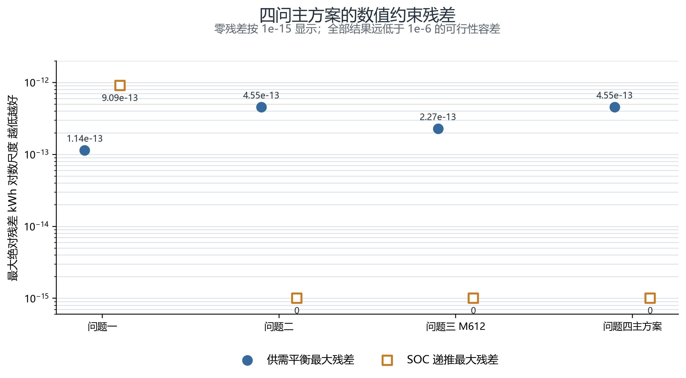
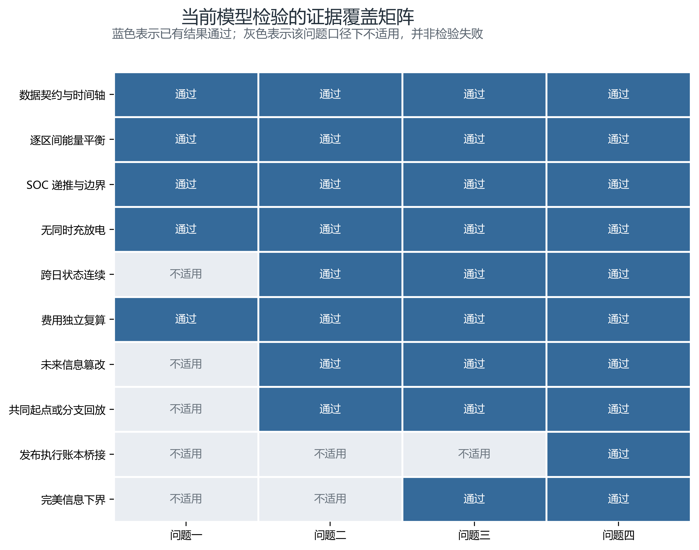
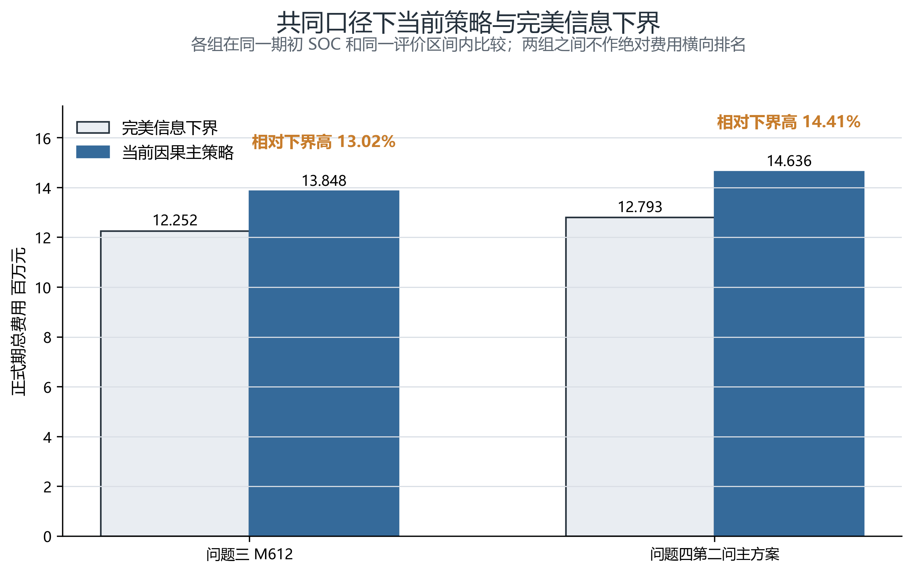

# 模型检验

本章集中检验前述四个模型是否在现有数据范围内满足“**数据可用、约束可行、决策无前视、账单可复算、求解可复现、结果有合理边界**”六项要求。这里的检验对象不是某个参数取值是否最优，也不讨论参数扰动后的敏感性与鲁棒性；后两类内容应另列专章。为避免只凭求解器返回的 `optimal` 状态作判断，本文同时使用逐区间约束回代、独立费用复算、未来信息篡改、共同起点回放、发布—执行账本桥接和完美信息下界等检验。只有当数值、时间和经济三条证据链相互一致时，才认为模型通过检验。

## 1. 数据契约与时间语义检验

四问共享同一套预处理数据，因此首先检验输入层是否会向后续模型传递系统性错误。对原始数据共设置 30 项质量检查，覆盖主键唯一性、缺失值、数值类型、功率与电价的时间间隔、日内 144 个十分钟区间的完整性、日期连续性、预测发布时间与预测目标时刻的映射，以及负荷、光伏、电价和预测量的单位一致性，30 项均通过。原始主表包含 52,560 个区间，去除仅用于初始化和预热的部分后，正式评价区间为 48,096 个，对应 334 个完整自然日。

时间语义是本题最容易产生“结果看似更优、实则使用未来信息”的环节。本文明确区分：负荷和光伏实测量按区间末端结算，电价按区间起点生效，预测值只能在其发布时间之后进入决策。随后对未来实测数据进行篡改，重新生成当期可见信息与已发布计划；问题二至问题四在篡改前后的当期输入、已锁定控制量及计划前缀保持一致。这说明滚动决策读取的是当时可获得的信息，而不是通过数组切片、日期连接或全样本统计量间接读取未来真值。

该项检验的结论是：输入数据在结构上完整，时间轴连接正确，正式评价期口径统一，且未发现前视泄漏。需要强调的是，“数据契约通过”只说明数据被正确地送入模型，并不等价于预测本身准确；预测误差是否会改变策略效果属于另行设置的稳健性检验。

## 2. 物理约束与数值可行性检验

对每个问题的主方案，均将求解结果逐区间代回供需平衡式和储能状态递推式。记按各问结算口径构造的供需平衡残差为

$$
r_t^{\mathrm{bal}}=\text{区间供给}_t-\text{区间需求}_t,
$$

储能递推残差为

$$
r_t^{\mathrm{soc}}=S_{t+1}-S_t-\eta_c C_t+\frac{D_t}{\eta_d},
$$

其中 $S_t$ 为区间初始储能量，$C_t,D_t$ 分别为充、放电量，$\eta_c,\eta_d$ 为充、放电效率。以

$$
\varepsilon_{\mathrm{bal}}=\max_t|r_t^{\mathrm{bal}}|,\qquad
\varepsilon_{\mathrm{soc}}=\max_t|r_t^{\mathrm{soc}}|
$$

作为最严格的全期残差指标，结果如下。

| 主方案 | 最大供需平衡残差/kWh | 最大 SOC 递推残差/kWh | SOC 范围/kWh | 同时充放电区间数 | 检验结论 |
|---|---:|---:|---:|---:|---|
| 问题一 | $1.14\times10^{-13}$ | $9.09\times10^{-13}$ | $[1200,10800]$ | 0 | 通过 |
| 问题二 LDR | $4.55\times10^{-13}$ | 0 | $[1200,10800]$ | 0 | 通过 |
| 问题三 M612 | $2.27\times10^{-13}$ | 0 | $[1200,10800]$ | 0 | 通过 |
| 问题四主方案 | $4.55\times10^{-13}$ | 0 | $[1200,10800]$ | 0 | 通过 |

**图 1 结果解读。** 四问最大平衡残差均不超过 $4.55\times10^{-13}$ kWh，最大状态残差不超过 $9.09\times10^{-13}$ kWh，比本文采用的 $10^{-6}$ 可行性容差低六个数量级以上。问题二至问题四显示为 0 的状态残差在图中按 $10^{-15}$ 作示意，仅为便于在对数坐标下展示，并非人为改写检验值。这些误差处于双精度浮点运算的舍入量级，不会造成可结算电量或费用偏差。

除等式约束外，四问所有 SOC 均位于 $[1200,10800]$ kWh，充放电功率未越过设备上限；同时充、放电区间数均为 0，问题二至问题四还满足“紧急购电时不充电”的执行逻辑。问题一的初、末 SOC 均为 6000 kWh，问题二至问题四的逐日末状态均能与下一日初状态无缝连接。因此，当前结果不是依靠透支期末库存、跨日重置电池或同时充放电形成的虚假低成本。

## 3. 因果性与不可预见性检验

物理可行并不意味着方案能够在线执行。问题二至问题四均为滚动决策，因而还需检验“不使用决策时点之后的信息”。本文从以下三层进行检查。

第一，**信息集封闭性**。在任一发布时点，模型只读取已经发布的预测、已经观测的实际量、已知电价和当前 SOC。未来实测负荷、未来实测光伏及尚未发布的更新预测均不在可见信息集中。对未来真值作大幅篡改后，当期风险曲线、计划前缀和已执行动作保持不变，说明程序实现与数学定义一致。

第二，**执行前缀锁定**。当 6 时、12 时或后续更新到达时，已经执行的十分钟区间不重新优化，只允许调整尚未执行的后缀。问题三的工作簿检验中，更新前已执行区间的改变量为 0；问题四的基准分支回放与锁定的 M612 分支在逐日费用和 SOC 上一致。该结果排除了“事后用新预测改写早晨计划”的可能。

第三，**共同起点与共同口径**。比较不同更新策略或完美信息下界时，统一使用相同的评价区间和期初 SOC。问题三因果策略与完美信息方案均从 2148.5983 kWh 的期初 SOC 出发；否则，较高的初始库存会被错误解释为策略优势。

**图 2 结果解读。** 蓝色表示已有输出给出了通过证据，灰色表示该问题口径下不适用，并非检验失败。例如问题一是确定性单周期优化，不需要未来信息篡改和发布—执行账本桥接；问题四则包含完整的滚动发布、执行与结算链，因此检验项目最多。矩阵表明，随着模型从静态优化扩展到在线调度，检验并未停留在统一的“残差小于容差”，而是同步增加了时间因果和账本一致性检查。

## 4. 费用账本与独立复算检验

求解器目标值只能证明内部优化目标的取值，不能自动证明最终账单正确。为此，本文不调用目标函数缓存，而是从输出的逐区间购电量、调整量、紧急购电量和相应电价重新计算费用，并与汇总结果逐项核对。

问题一的独立费用复算误差为 0。问题二按 48,096 个正式区间重新结算，计划购电费为 13,332,849.50 元，紧急购电费为 645,227.73 元，总费用为 13,978,077.23 元，与汇总文件和提交工作簿完全一致。问题三 M612 的独立总费用为 13,848,036.20 元，其中保留计划费 12,908,994.19 元、下调费 323,553.27 元、上调费 186,225.45 元、紧急购电费 429,263.29 元，四项加总与总账一致；计划表再次回代后的最大调度误差为 $2.27\times10^{-13}$ kWh。

问题四由于“发布计划”与“实际执行计划”跨日衔接，不能直接把发布行费用相加作为正式执行费用，因此额外构造账本桥接：

$$
C_{\mathrm{exec}}
=C_{\mathrm{issue}}+C_{\mathrm{carry\text{-}in}}-C_{\mathrm{carry\text{-}out}}.
$$

现有结果中，发布行费用为 14,178,759.32 元，正式期带入费用为 144.59 元，期末带出费用为 287.49 元，故执行计划费为

$$
14{,}178{,}759.32+144.59-287.49=14{,}178{,}616.41\ \text{元},
$$

桥接误差为 0；再加紧急购电费 457,857.44 元，得到正式期总费用 14,636,473.85 元。该检验尤其重要，因为它证明跨日滚动计划没有被重复收费，也没有遗漏评价边界上的已发布电量。

## 5. 求解状态与批量复现检验

问题一的主问题与二阶段精化问题均由线性规划求解，两个阶段均返回最优状态，且二阶段费用未突破主问题的最优费用容差。对连续线性规划而言，这一状态与极小的原始约束残差共同构成全局最优性的数值证据。

问题二的外层规则参数由非凸搜索确定，内层日调度为线性规划。已有 337 个校准与搜索日均得到可接受解，最终入选方案在预设保护规则下从未劣于零参数基线。这里能够确认的是：给定外层参数后，内层调度可稳定求解，且最终方案通过基线保护；不能据此声称非凸外层搜索已经找到理论全局最优值。

问题三各更新策略的日内再优化均返回可行解，输出表头、区间数量、非负调整量以及更新前缀均通过独立工作簿校验。问题四现有 54 次全年回测共求解 17,368 个候选线性规划，所有候选均返回最优状态，求解失败数和保底方案启用数均为 0。由此说明模型不仅能在少数展示日上运行，而且可以在完整年度滚动链条中重复执行。

## 6. 完美信息下界检验

为判断当前因果策略的费用是否处于合理数量级，本文构造“完美信息”模型：在保持设备参数、结算规则、评价区间和期初 SOC 不变的前提下，允许优化器预先知道评价期内的真实负荷和光伏。由于该方案拥有现实策略不可能获得的信息，其最优费用只能作为理论下界，而不能作为可部署的竞争方案。

问题三 M612 的因果策略费用为 13,848,036.20 元，匹配期初 SOC 后的完美信息下界为 12,252,452.93 元，绝对差距为 1,595,583.27 元，相对下界高 13.02%。问题四第二问主方案费用为 14,636,473.85 元，相应下界为 12,793,144.36 元，绝对差距为 1,843,329.48 元，相对下界高 14.41%。两项因果策略均严格高于其下界，方向正确；若因果策略反而低于同口径的完美信息最优值，则意味着费用口径、期初状态或信息边界至少有一项不一致。

该差距不能全部解释为模型低效，因为完美信息模型消除了预测误差和更新延迟，其优势本身不可实现。更合理的解释是：13.02% 和 14.41% 给出了“预测、更新频率与在线控制仍可能改进的总空间上限”。同时，问题三与问题四采用的价格和结算机制不同，因此图中只允许每组内部比较，不据两组柱高对问题三、问题四作绝对优劣排序。

## 7. 机制一致性检验

最后检查优化结果是否具有与目标函数一致的行为方向，以防出现“数值通过但经济逻辑反常”的情况。

问题二中，名义覆盖率为 80% 的风险曲线在正式期的实际覆盖率为 76.94%，说明样本尾部存在约 3 个百分点的轻微乐观偏差；但 95.24% 的紧急购电区间发生在实际净负荷超过风险曲线之后，表明风险曲线与补购机制的触发方向一致。LDR 的紧急购电量虽略高于固定低保留基线，但紧急购电费更低。这并非矛盾：模型优化的是费用而非补购电量，它把有限电池库存优先保留给高价缺口，因此可能允许低价时段多买一些、同时减少高价时段的补购。

问题三中，12 时光伏更新带来的价值稳定为正且构成主要收益来源，18 时负荷更新的边际价值接近零。该现象与日内光伏不确定性主要集中在中午、18 时以后可调整区间已经较少的时间结构一致。问题四引入波动电价后，价格加权分位数规则降低了高价缺口对应的紧急费用；相反，若增加更新却抬高总费用，其原因可追溯到调整费与紧急费之间的替代，而不是平衡约束失效。上述行为均能由价格、信息到达时点和库存机会成本解释，未发现与模型目标相反的系统性动作。

## 8. 检验结论与适用边界

综合六类证据，当前四问模型在已有数据上通过检验：数据结构与时间映射正确；供需平衡、SOC 递推及设备边界均满足；滚动策略未使用未来信息，已执行计划不会被后续预测改写；逐区间独立结算与汇总账单一致；批量求解能够稳定复现；因果策略费用位于完美信息下界之上且差距处于可解释范围。因此，论文中关于各主方案可行性、费用构成和更新价值的结论具有一致的数值与机制证据。

该结论仍有明确边界。第一，检验通过只代表模型内约束正确，不代表已经覆盖电池衰减、设备停运、通信延迟等全部工程因素；第二，问题二外层非凸参数搜索无法由现有证据证明全局最优；第三，完美信息差距是改进空间的上界，不能直接归因于某一个预测变量；第四，所有结论均基于给定年度和现有价格样本，对跨年度、制度变化或更极端尾部事件的外推需要新增样本验证。上述限制不否定当前结果，但限定了模型结论可以被安全使用的范围。

---

### 图件与复现说明

- 本章三幅 PNG 图位于 `paper/model_validation_assets/`，同目录提供 SVG 矢量版本，可直接用于论文排版。
- 绘图脚本为 `paper/model_validation_assets/generate_validation_figures.py`，图 1 和图 3 的数据由现有 JSON 结果直接读取，未手工改写数值。
- 主要检验数据来源包括：`outputs/preanalysis/quality_checks.csv`、`outputs/question1/question1_summary.json`、`outputs/question2/current/ldr/question2_summary.json`、`outputs/question2/current/ldr/ldr_validation.json`、`outputs/question3/current/question3_summary.json`、`outputs/question3/current/question3_workbook_validation.json`、`outputs/question3/benchmark/matched_m612_summary.json`、`outputs/question4/v2/result4-2/run_summary.json`。
