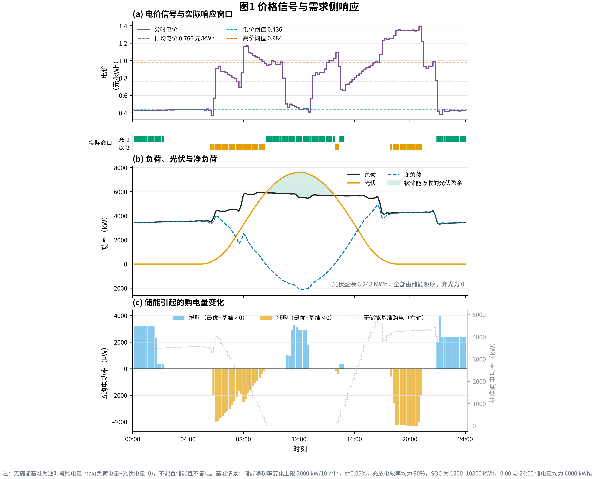
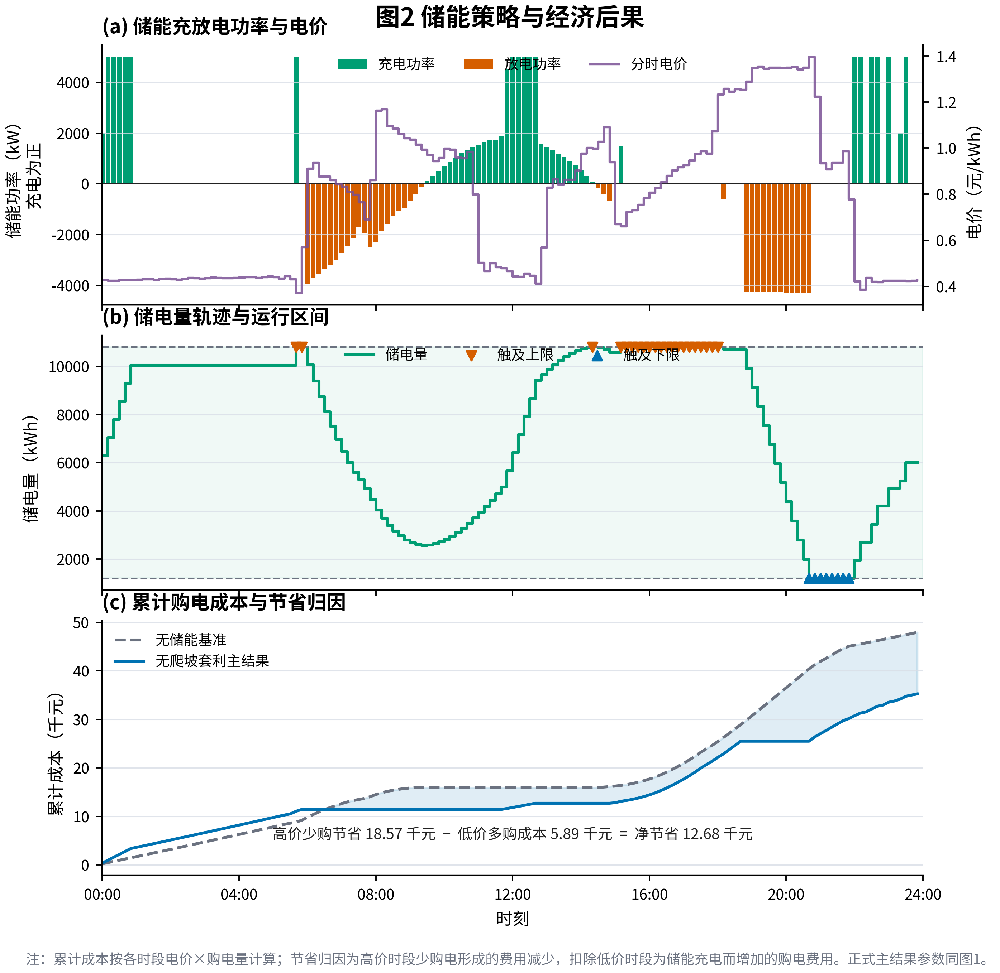
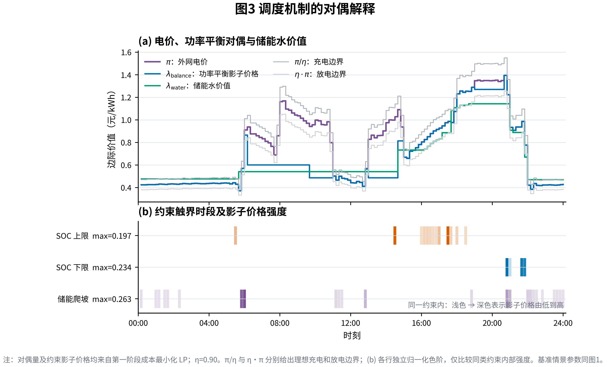
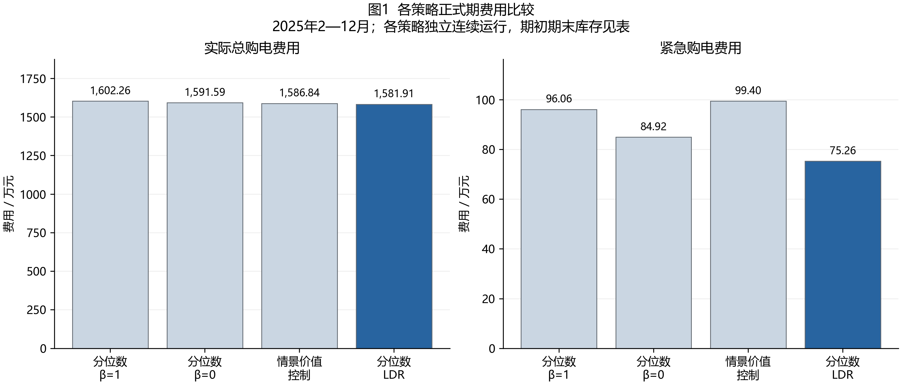
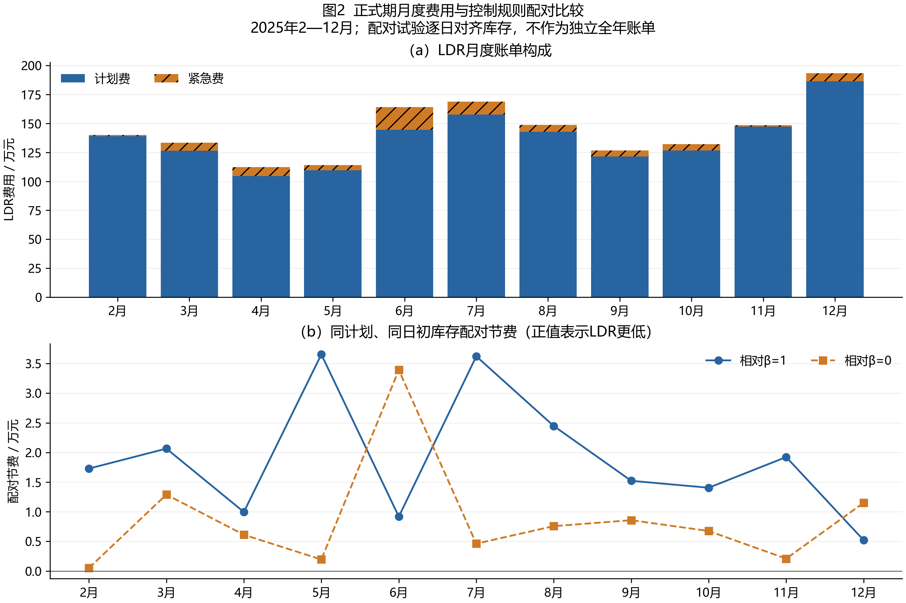
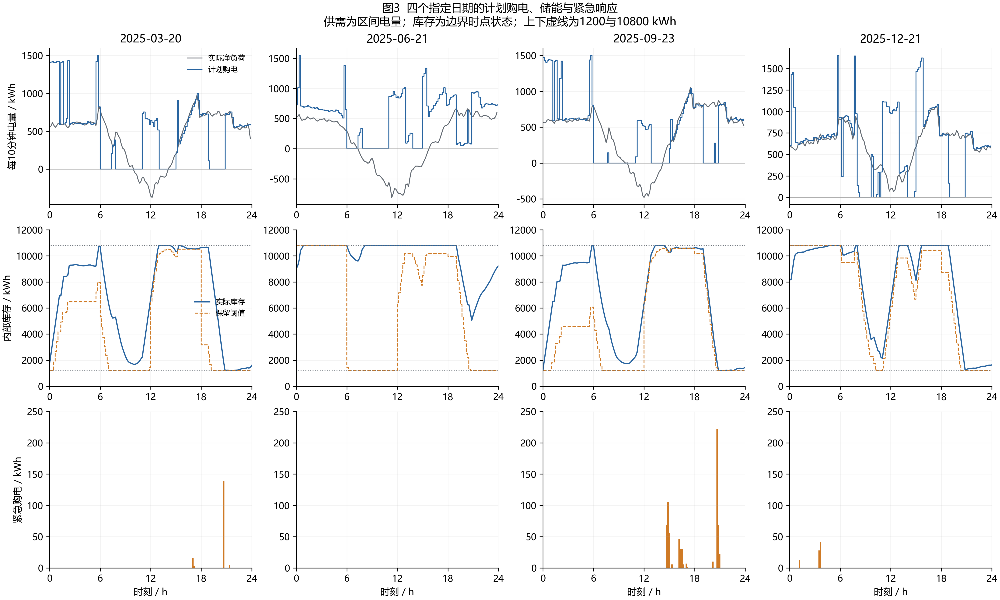

# 问题一、问题二完整叙述与补全稿

> 依据：`初稿1(1).docx`（已提取全文核对）、`outputs/question1/`、`outputs/question2/current/ldr/` 的最终运行结果、`outputs/question2/current/paper/问题二完整解答_LDR主方案.md`、`docs/问题二/增强论证数据/`。
> 本文档所有数字均来自已核验的运行输出，与 `result1.xlsx`、`result2.xlsx` 一致，可直接粘贴进论文。
> 用法：**第一部分**是差距诊断（回答"还差什么"），**第二部分**是叙述逻辑（回答"怎么组织"），**第三、四部分**分别是问题一、问题二的完整 md 正文（可直接作为论文第六、七章）。

---

# 第一部分：差距诊断

## 1.1 全篇性问题（同时影响两问）

| # | 缺失项 | 现状 | 补法 |
|---|---|---|---|
| 1 | 摘要、关键词 | 空白 | 全文完成后统一写；问题二可用其完整解答文档开头的摘要改写 |
| 2 | 二、问题分析（2.1—2.4） | 四小节全部空白 | 用本稿第三部分 §6.0、第四部分 §7.0 的"问题分析"文字 |
| 3 | 三、模型假设 | 空白 | 用本稿 §6.1.1、§7.1.1 中的"模型假设"清单 |
| 4 | 四、符号说明 | 空白 | 用本稿两章各自符号表汇总 |
| 5 | 五、数据预处理 | 编号跳号：只有（1）和（3），缺（2）；且**未写问题一的"电价区间起点、负荷/光伏区间终点"对齐口径**——这是问题一结果正确性的前提，也是评委最容易质疑的点 | 补（2）"实际运行数据整理"；在 6.0 中单列时间口径段落 |
| 6 | 图表题注 | "图 SEQ 图 \* ARABIC 1"域代码未刷新 | Word 全选 Ctrl+A → F9 刷新域，或改手动编号 |
| 7 | 公式排版 | 多处上下标/求和号渲染丢失（如 `t=0143ctgtbuy`、`50006`、`Li,t−Li,t`） | 按本稿 LaTeX 公式重录 |

## 1.2 问题一缺项清单

| 缺项 | 为什么必须补 | 本稿位置 |
|---|---|---|
| 2.1 问题分析空白 | 不写清楚"信息完全→确定性 LP→两阶段词典序"的逻辑，模型是"从天而降"的 | §6.0 |
| 时间对齐口径缺失 | result1 每行购电量对应哪个电价、哪条负荷/光伏，初稿没写；写错则全部数字错位 | §6.0 表1 |
| 符号表单位混乱 | `Lt` 定义为功率却在电量平衡式中直接出现；`Pmax·Δt=5000/6` 渲染成 50006 | §6.1.1 |
| 约束编号错乱 | 6.1.2.1 中（3）标题编号丢失，（4）标题与公式挤一行 | §6.1.2 重排 |
| 第二阶段成本约束公式错误 | 求和号与上下标丢失，`ε_num` 取值未交代 | §6.1.3 式(7) |
| **无储能基准未定义** | 正文说"与无储能基准相比节省 26.45%"，基准从未定义，结论无根 | §6.3.2 |
| 结果分析只有一句 | 缺"低价充电—高价放电"的调度机制叙事、指定时刻零购电的原因解释 | §6.3.3 |
| 对偶解释缺定义 | "水价值"概念突然出现 | §6.3.4 先定义再解释 |
| 缺结果校验小节 | 求解器级 PASS 数据（残差 1e-13、同时充放电 0 等）未进论文 | §6.4 表 |
| 缺敏感性/拓展 | 已有储能爬坡率敏感性 7 行数据闲置未用 | §6.5 |
| 缺问题一小结与过渡 | 与问题二之间没有"从确定性到不确定性"的衔接 | §6.6 |

## 1.3 问题二缺项清单

| 缺项 | 为什么必须补 | 本稿位置 |
|---|---|---|
| **7.2.4 求解结果及分析完全空白** | 最大缺项：四个指定日期表1/表2/表3、全年总费用、策略对比、完美信息下界全部缺失，问题二等于没做完 | §7.7 |
| 模型叙述自相矛盾 | 7.1.4.3 说"日内无需重新优化"，7.1.5 又把控制规则嵌入日前模型做 MILP；**最终主方案是"固定计划＋同规则情景评价＋差分进化校准 7 参数"**，7.1.5 的 MILP 应降级为扩展方案一句话带过 | §7.5 |
| 符号混乱 | 残差公式 hat 丢失（`εi,tL=Li,t−Li,t`）；`gt` 与 `g_t` 混用；`Ctp/Dtp` 与 7.1.5 的 `Ct/Dt` 混用；`bt` 定义与实际/情景两层含义混用 | §7.1.2 符号表 |
| 预测方法缺依据 | 周持久化/7 天均值只给公式不给依据；需写"负载周内日型稳定"的支撑与预测精度对比 | §7.2.1 |
| α=0.8 推导后话没闭环 | "计入储能缓冲后 0.75–0.80"无出处；主方案必须写死 α=0.8 并说明它是**预先固定的风险设计**而非事后扫描 | §7.2.3 |
| 差分进化缺配置表 | 无参数表（7 维、种群 5、8 代、边界、种子、接受规则），评审无法复现 | §7.5.2 表 |
| 非预见性只有口号 | 需"相同输入路径⇒相同动作"的形式化论证＋测试证据 | §7.4.4、§7.8.2 |
| 缺全年连续仿真与初始化 | 1/1 冻结、1 月预热、正式期 2/1—12/31、跨日 SOC 继承完全没写 | §7.6.1 |
| 缺与问题一的衔接 | 未说明问题二为何**不再要求日初日末 SOC 相等**（跨日连续），评委必问 | §7.0 |
| 缺四类检验 | 物理/账单/信息边界/模板回读的数字全部缺失 | §7.8 |
| 缺敏感性/稳健性 | 9 个变体的敏感性数据闲置 | §7.8.3 |
| 缺模型评价与结论 | 优点/局限/结论三件套缺失 | §7.9、§7.10 |

---

# 第二部分：完整叙述逻辑

## 2.1 问题一："完整信息下的确定性单日优化"

评委阅读动线（每节回答一个问题）：

```
6.0 问题分析      → 为什么这是 LP？为什么分两阶段？（信息完全→确定性优化；储能=时间搬运装置）
6.1 模型建立      → 物理世界怎么写进数学？（平衡/SOC/容量/功率/首末闭环）
   └ 两阶段词典序 → 为什么第一层最优会多解？为什么第二层吞吐最小？
6.2 模型求解      → 为什么 LP 全局最优？HiGHS 怎么跑？
6.3 结果          → 表1、表2 → 无储能基准对比 → 调度机制叙事 → 对偶解释
6.4 模型检验      → 用残差数字证明"解是对的"
6.5 拓展          → 爬坡敏感性（证明主模型"不设爬坡"是有意选择）
6.6 小结          → 一句话结论 + 引出问题二
```

**一条主线**：储能把低价时段（夜间/光伏富余）的电搬运到高价时段（早晚高峰），省下 26.45%；两阶段词典序保证"省同样的钱时动作最干净"；对偶变量证明调度不是拍脑袋。

## 2.2 问题二："信息不完全下的三层因果调度"

评委阅读动线：

```
7.0 问题分析      → 难点三连：0:00 只有历史数据 / 5倍紧急价非对称惩罚 / 买多不退款
                    与问题一的三个区别：要预测、要风险余量、SOC跨日连续
7.2 预测与风险修正 → 周持久化+7天均值 → 21条成对残差情景 → 报童推导 α=0.8（第一层）
7.3 日前计划 LP   → 风险修正曲线上的计划购电量+参考SOC（第二层）
7.4 日内因果控制  → 截断仿射保留阈值：固定计划、按已观测误差放电/保留
7.5 参数校准      → 同一规则用于情景评价与真实执行；DE 校准 7 参数（第三层）
7.6 仿真与结算    → 全年连续 SOC、1 月预热、正式期 2—12 月、真实账单
7.7 结果          → 证据链四件套：①四策略独立对比 ②同计划配对 ③完美信息下界 ④四个指定日期
7.8 检验与稳健性  → 物理/账单/信息边界/回读 + 9 变体敏感性
7.9—7.10 评价结论  → 优点、局限、"当前配置下最优"的边界声明
```

**一条主线**：计划购电像"报童订报"——按 80% 分位数下单；日内储能像"水库调度"——按已观测到的偏差决定放水还是蓄水（截断仿射保留阈值）；所有决策只用当前已获得的信息（因果性），全年连续运行、真实账单结算。

---

# 第三部分：问题一完整 md（对应初稿"六、问题一的模型建立与求解"）

## 6.0 问题分析（填入初稿 2.1）

问题一给出**每天不变的分时电价与小区负载、全天已知的光伏预测功率**，并要求 0:00 制定当天计划购电策略、储能 0:00 与 24:00 储电量相同。决策所需的全部信息在 0:00 已经确定，因此这是一个**确定性单日优化问题**：储能是唯一跨时段耦合的装置，其作用是时移——在电价低或光伏富余时充电，在电价高或供电不足时放电，从而降低全天购电费用。

建模时须明确三点。第一，**时间口径**：附件中电价是购电区间的起点价格，负荷与光伏是区间终点状态，因此 00:00—00:10 区间使用"0:00+1"行电价、满足"00:10"行负荷/光伏，后续区间顺移一格（见表 1）。第二，**约束全集**：功率平衡（含弃电变量）、储能 SOC 递推、容量安全、充放电功率、日初日末 6000 kWh 闭环。第三，**多解问题**：目标函数只含购电费时，LP 可能存在等费用的退化多解（如无效的"同时充放电"循环），故采用**两阶段词典序优化**——先最小化购电费，再在等费用解中最小化充放电吞吐量。全部约束与目标均为线性，选用线性规划即可获得全局最优解，无需引入 0-1 变量。

## 6.1 模型建立

### 6.1.1 数据口径、模型假设与符号

**模型假设**：（1）电价、负载、光伏预测全天已知且确定；（2）每个 10 分钟区间内功率恒定，统一用区间电量表述；（3）充、放电效率各为 90%；（4）不允许向外网售电，光伏盈余只能由储能吸收或弃掉；（5）主模型不设储能爬坡约束（题面未给爬坡参数，§6.5 做敏感性拓展）；（6）储能 0:00 储电量为 6000 kWh，24:00 必须回到 6000 kWh。

取时间步长 Δt=1/6 h，全天 T=144 个区间。以下符号全部为**区间电量口径（kWh）**，附件中的功率值已统一乘以 Δt。

| 符号 | 含义 | 取值/单位 |
|---|---|---|
| $c_t$ | 区间 t 的购电电价（区间起点价） | 元/kWh |
| $L_t$ | 区间 t 的小区负载电量 | kWh |
| $V_t$ | 区间 t 的光伏预测电量 | kWh |
| $E_0, E_T$ | 0:00 初始、24:00 末端储电量 | 6000、6000 kWh |
| $E_{\min}, E_{\max}$ | 储能电量安全下、上限 | 1200、10800 kWh |
| $S$ | 单区间充/放电量上限 $=5000\times\Delta t$ | 833.3333 kWh |
| $\eta$ | 充、放电效率（各 90%） | 0.9 |
| $g_t$ | 区间 t 外网购电量 | kWh，$\ge0$ |
| $C_t, D_t$ | 区间 t 交流侧充电量、放电量 | kWh |
| $E_t$ | 区间 t 末储能储电量 | kWh |
| $U_t$ | 区间 t 弃电量 | kWh |

### 6.1.2 约束条件

（1）微网功率平衡约束：每个区间供电量必须满足小区负载，

$$g_t+V_t+D_t=L_t+C_t+U_t,\qquad t=1,2,\dots,T, \tag{1}$$

$$g_t\ge0,\qquad 0\le U_t\le V_t,\qquad \forall t. \tag{2}$$

（2）储能储电量递推约束：考虑充放电效率，

$$E_t=E_{t-1}+\eta C_t-\frac{D_t}{\eta},\qquad t=1,2,\dots,T. \tag{3}$$

（3）储能容量安全约束：

$$E_{\min}\le E_t\le E_{\max}\ \Longrightarrow\ 1200\le E_t\le10800,\qquad t=1,\dots,T. \tag{4}$$

（4）初始与终端储电量约束（日内闭环，避免靠消耗期末储能获得虚假成本优势）：

$$E_0=6000,\qquad E_T=6000. \tag{5}$$

（5）储能充放电功率约束：

$$0\le C_t\le S=\frac{5000}{6},\qquad 0\le D_t\le S=\frac{5000}{6},\qquad \forall t. \tag{6}$$

### 6.1.3 两阶段词典序目标函数

**第一阶段（经济性最优）**：最小化全天购电费用

$$\min\ Z_1=\sum_{t=1}^{T}c_t\,g_t,\qquad \text{记最优值为 } Z_1^{*}. \tag{7}$$

**第二阶段（等费用吞吐量最小）**：第一阶段以购电费为唯一目标时可能存在多个费用相同的最优解；由于充放电效率小于 1，无效的同时充放电会凭空增加吞吐量。因此在保持第一阶段最优费用的基础上，进一步最小化充放电总吞吐量：

$$\min\ Z_2=\sum_{t=1}^{T}\bigl(C_t+D_t\bigr), \tag{8}$$

$$\text{s.t.}\quad \sum_{t=1}^{T}c_t g_t \le Z_1^{*}+\varepsilon_{\mathrm{num}}, \tag{9}$$

其中 $\varepsilon_{\mathrm{num}}=3.5\times10^{-6}$ 元仅为求解器浮点容差（约为最优费用的 $10^{-10}$ 倍），不构成实际成本放宽。两阶段共同构成词典序优化

$$\operatorname{lexmin}\left(\ \sum_{t=1}^{T}c_t g_t,\ \sum_{t=1}^{T}(C_t+D_t)\ \right), \tag{10}$$

即先保证全天购电费用最优，再在经济等价方案中选储能动作最干净者。

## 6.2 模型求解

模型决策变量约 720 个，目标与约束全部线性，采用**HiGHS 线性规划求解器**顺序求解两个阶段：

1. **第一阶段**：求解式(1)—(7)，得最优购电费用 $Z_1^{*}$；
2. **第二阶段**：追加成本约束式(9)，求解式(8)，得最终调度方案；
3. **结果校验**：逐区间检查功率平衡残差、SOC 递推、容量与功率边界、首末 SOC、弃电非负与同时充放电计数。

线性规划保证在连续可行域上获得全局最优解；第二阶段只改变目标、不改变可行域的经济最优集，因此最终方案仍为购电费用全局最优。

## 6.3 求解结果及分析

### 6.3.1 题目要求的表 1、表 2

**表 1　微网在指定时间段的购电量及全天的购电量和购电费**

| 时间段 | 购电量(kWh) | 时间段 | 购电量(kWh) | 时间段 | 购电量(kWh) |
|---|---|---|---|---|---|
| 10:00-10:10 | 0.0000 | 12:00-12:10 | 480.4125 | 14:00-14:10 | 0.0000 |
| 16:00-16:10 | 445.4317 | 18:00-18:10 | 641.1613 | 20:00-20:10 | 0.0000 |
| **全天购电量** | **59352.2408** | **全天购电费** | **35245.3072 元** | | |

**表 2　储能设备在指定时间段的充放电量及 0:00 和 24:00 的储电量**

| 时间段 | 充电量(kWh) | 放电量(kWh) | 时间段 | 充电量(kWh) | 放电量(kWh) |
|---|---|---|---|---|---|
| 0:00-4:00 | 4500.0000 | 0.0000 | 4:00-8:00 | 833.3333 | 5697.5873 |
| 8:00-12:00 | 3434.1779 | 1702.9970 | 12:00-16:00 | 5953.1993 | 203.1913 |
| 16:00-20:00 | 0.0000 | 5064.2630 | 20:00-24:00 | 5333.3333 | 3575.7370 |
| **0:00 储电量** | **6000** | | **24:00 储电量** | **6000** | |

### 6.3.2 与无储能基准的对比

定义无储能基准为：光伏盈余不能存储（全部弃掉），购电量直接取各区间净负荷正部 $g_t^{\text{base}}=\max(L_t-V_t,0)$。基准购电费为 47921.7741 元；两阶段优化后购电费降至 **35245.3072 元**，节省 **12676.4668 元，降幅 26.4524%**。第二阶段与第一阶段费用仅差 $3.5\times10^{-6}$ 元，属求解器数值容差，说明第二阶段的吞吐最小化没有牺牲任何经济性。

### 6.3.3 调度机制解释（对应图 1、图 2）





优化方案呈现出清晰的"低价充电—高价放电"结构：

- **0:00—4:00（夜间低谷价）**：充电 4500 kWh，SOC 由 6000 升至约 10050 kWh，接近容量上限；
- **4:00—8:00（早高峰）**：放电 5697.59 kWh 显著大于充电，SOC 回落至约 4469 kWh；
- **8:00—16:00（白天光伏富余+平价）**：净充电为主，12:00—16:00 末 SOC 触及上限 10800 kWh；
- **16:00—20:00（晚高峰高价）**：只放不充（放电 5064.26 kWh，充电 0）；
- **20:00—24:00**：低价补电并平抑晚间余量，24:00 精确回到 6000 kWh。

指定时刻的购电量与此一致：10:00、14:00、20:00 由光伏与储能放电覆盖实现**零购电**；12:00、16:00、18:00 等储能/光伏不足以覆盖的区间才从外网补购。全程无弃光（$U_t=0$）、无同时充放电，储能 SOC 始终位于 1200—10800 kWh 之内。图 1（c）以"最优购电−无储能基准购电"的柱状差清楚显示：优化方案在**高价时段大幅少购**、在**低价时段增购**，这正是 26.45% 节费的来源。

### 6.3.4 基于对偶变量的调度机制解释（对应图 3）



为解释储能充放电时机的内在机理，考察 LP 的对偶变量。定义：功率平衡约束式(1)的影子价格为 $\lambda^{\text{bal}}_t$；SOC 递推约束式(3)的对偶变量即储能的**水价值** $\lambda^{\text{water}}_t$，表示单位存量在未来时段可替代的购电价值。放电的等效替代成本下界为 $\pi_t/\eta$（放出 1 kWh 需多购 $1/\eta$ kWh），充电在未来释放的价值上限为 $\eta\,\pi_t$。图 3 显示：功率平衡影子价格始终落在 $[\eta\pi_t,\ \pi_t/\eta]$ 的套利带内，储能恰在"当前电价低于未来等效价值"时充电、反之放电；SOC 在 12:00—16:00 触及上限 10800 kWh，说明容量约束在该时段真实起作用（对偶变量非零）。可见调度并非简单跟随电价，而是电价、储能剩余价值与容量边界三者共同作用的结果。

## 6.4 模型检验

对最终方案逐区间复检，全部通过：

| 核验项目 | 结果 |
|---|---|
| 功率平衡最大残差 | $1.14\times10^{-13}$ kWh |
| SOC 递推最大残差 | $9.09\times10^{-13}$ kWh |
| SOC 范围 | 始终在 1200—10800 kWh |
| 单区间最大充电/放电量 | 833.3333 / 715.8689 kWh（≤S 且互斥） |
| 同时充放电区间数 | 0 |
| 0:00 / 24:00 SOC | 6000 / 6000 kWh |
| 购电、弃电非负 | 成立（弃电量恒为 0） |
| 独立复算购电费 | 35245.3072 元，与目标值一致 |

## 6.5 拓展：储能爬坡率敏感性分析

主模型未设爬坡约束（题面未给参数）。为考察若储能变流器存在硬爬坡限制的影响，追加 $|B_t-B_{t-1}|\le R_B\Delta t$（$B_t=C_t-D_t$）的拓展模型：

| $R_B$(kW/10min) | 第一阶段成本增幅 | 最终成本增幅 | 动作总变差(MWh) | 模式切换数 |
|---:|---:|---:|---:|---:|
| 500 | 1.8219% | 1.8728% | 5.612 | 9 |
| 1000 | 0.8333% | 0.8837% | 5.875 | 9 |
| 1500 | 0.5020% | 0.5522% | 6.158 | 9 |
| 2000 | 0.2994% | 0.3495% | 6.669 | 10 |
| 3000 | 0.1432% | 0.1932% | 7.624 | 10 |
| 4000 | 0.0397% | 0.0897% | 8.261 | 11 |
| 5000 | 0.0000% | 0.0500% | 8.813 | 11 |

爬坡限制越严，动作越平滑但费用越高；$R_B\ge5000$ kW/10min 时对经济最优解已无约束力。由于题面未给出真实 $R_B$，本表仅作拓展情景，不作为主模型参数。

## 6.6 问题一小结

在电价、负载与光伏预测完全已知的条件下，两阶段词典序线性规划给出全天最优购电策略：购电费 35245.31 元，较无储能基准节省 26.45%，且储能在 24:00 精确回到 6000 kWh，全程无弃光、无同时充放电。问题一的价值在于给出确定性情形下的最优套利结构与检验标准；实际运行中负载与光伏在 0:00 并不可知，且供电不足须按 5 倍电价紧急购电——这正是问题二要解决的"信息不完全下的日前决策"问题。

---

# 第四部分：问题二完整 md（对应初稿"七、问题二的模型建立与求解"）

## 7.0 问题分析（填入初稿 2.2）

问题二在问题一基础上放开两个条件：小区负载与光伏发电功率**逐日逐时变化**，且供电不足时须按交易时刻电价 **5 倍紧急购电**。与问题一的本质区别有三：

1. **信息不完全**：每天 0:00 制定计划时，当天实际负载与光伏尚未发生，只能使用此前历史数据预测，计划全天锁定、日内不再调整；
2. **非对称惩罚**：计划买多不退款（未利用供能不能退货），买少按 5 倍价补购——这决定计划购电必须**预留风险余量**，且目标不是预测最准而是真实结算费用最低；
3. **跨日连续性**：问题一要求日初日末储电量相同；问题二为真实连续运行，储能状态沿真实时间跨日传递，**不按日重置**（否则相当于每天免费获得固定初始电量，夸大储能收益）。

据此构建"**风险修正日前计划—同规则情景校准—日内因果执行**"三层模型：第一层用历史残差情景的 80% 分位数形成风险修正曲线，在其上求计划购电量与参考 SOC；第二层**固定**该计划，在历史情景上以同一执行规则校准储能保留阈值参数；第三层日内按已观测信息执行同一规则，缺口由紧急购电补足。三层共用一条执行函数，从结构上保证物理可行性与信息非预见性。

## 7.1 模型假设、数据口径与符号

**模型假设**：（1）每天 0:00 锁定全天 144 个区间的普通购电计划，日内不调整；未利用电量不退款、不外售；（2）实际缺口在储能调节后仍存在时，按 5 倍电价紧急购电；（3）储能跨日连续，不移植问题一"日末=日初"约束；（4）区间级因果：当前区间的动作只使用区间开始前已揭示的信息；（5）充、放电效率各 90%；（6）富余才充电、缺口才放电，不为充电专门紧急购电；（7）风险分位水平 α=0.8、残差窗口 M=21 日等参数**在回测前固定**，不按全年事后结果挑选。

**符号**（日期 d、区间 t=1,…,144；电量均为区间电量 kWh）：

| 符号 | 含义 | 符号 | 含义 |
|---|---|---|---|
| $L_{d,t},V_{d,t},N_{d,t}$ | 实际负载、光伏、净负荷 | $\widehat L,\widehat V,\widehat N$ | 日前点预测 |
| $\widetilde N_{d,t}$ | 风险修正规划净负荷 | $c_t$ | 附件1固定电价 |
| $g_{d,t},b_{d,t}$ | 计划购电、紧急购电量 | $C_{d,t},D_{d,t},U_{d,t}$ | 充电、放电、未利用供能 |
| $E_{d,t}$ | 区间末实际库存 | $E^p_{d,t}$ | 日前 LP 参考库存 |
| $R_{d,t}$ | 放电保留阈值 | $\eta$ | 充放电效率 0.9 |
| $E_{\min},E_{\max},S$ | 1200、10800、833.3333 kWh | $M,\alpha$ | 残差情景数 21、分位数 0.8 |
| $a_{d,k}$ | 第 k 阶段前平均预测误差 | $\delta_{d,k},\lambda_{d,k}$ | 阈值截距修正、误差反馈系数 |
| $\nu$ | 日末库存价值代理 $\min_t c_t/\eta$ | $\theta$ | 7 维控制参数向量 |

以下推导略去日期下标 d。

## 7.2 预测、残差情景与 80% 风险设计

### 7.2.1 负载周持久化与光伏七天均值预测

附件 2 显示小区负载具有稳定的**周内日型结构**（周五、周六日均负载显著低于其他日），故负载取前一周同星期、同时段实际值（周持久化）；光伏波动快，取前七天同时段均值平滑：

$$\widehat L_{d,t}=L_{d-7,t},\qquad \widehat V_{d,t}=\frac17\sum_{i=1}^{7}V_{d-i,t},\qquad \widehat N_{d,t}=\widehat L_{d,t}-\widehat V_{d,t}. \tag{1}$$

1 月 2—7 日无完整一周前历史，负载退化为昨日持久化 $L_{d-1}$；光伏使用已有历史均值，1 月 8 日起用完整七天窗口。两种方法仅使用决策日前已完成日的数据，参数少、可逐日更新。预测精度对比显示：负载周持久化的正式期 MAPE 为 15.66%，基于官方日历日型的相似日模型（b1）与相似日高斯核（gk）分别达 4.13% 与 4.02%，说明点预测尚有改进空间；主方案费用回测仍采用透明、可复现的周持久化＋七天均值组合，更精细预测的最终费用比较留作扩展（见 §7.9 局限）。

### 7.2.2 保持同日配对的历史残差情景

对历史日 i，用其当时可得的预测计算残差

$$\varepsilon^{L}_{i,t}=L_{i,t}-\widehat L_{i,t},\qquad \varepsilon^{V}_{i,t}=V_{i,t}-\widehat V_{i,t}, \tag{2}$$

取决策日前最近 M=21 个有效完整日，**负载与光伏残差保持同日配对**（保留二者相关性），构造情景

$$N_{d,t,\omega}=\bigl[\widehat L_{d,t}+\varepsilon^{L}_{i_\omega,t}\bigr]^{+}-\bigl[\widehat V_{d,t}+\varepsilon^{V}_{i_\omega,t}\bigr]^{+},\qquad p_\omega=\frac1M. \tag{3}$$

$[x]^+=\max(x,0)$ 避免生成负功率；按完整日路径取样保留日内相关性。历史残差必须用其自身当时可得的预测计算，不得用决策日重拟合的残差替换。

### 7.2.3 固定 80% 分位数的报童经济推导

先忽略储能，单时段计划采购 g，未用电量无残值，则期望费用

$$\min_{g\ge0}\ F(g)=c\,g+5c\,\mathbb E\bigl[(N-g)^{+}\bigr], \tag{4}$$

最优性条件（分布连续时）

$$F'(g)=c-5c\,\mathbb P(N>g)=0\ \Longrightarrow\ \mathbb P(N\le g)=0.8. \tag{5}$$

即 **80% 分位数是普通价与 5 倍紧急价之间的精确成本平衡点**。据此将风险修正曲线固定为点预测与经验分位数（线性插值）的较大者：

$$\widetilde N_{d,t}=\max\Bigl\{\widehat N_{d,t},\ Q_{0.8}\bigl(N_{d,t,1},\dots,N_{d,t,M}\bigr)\Bigr\}. \tag{6}$$

必须说明：式(5)是单时段简化模型的结论，式(6)在加入储能耦合后是**预先固定的风险设计**而非全系统最优性定理；α=0.8 在回测前固定，不按全年事后扫描选择。

## 7.3 日前计划购电 LP

### 7.3.1 目标函数

以风险修正曲线 $\widetilde N_t$ 为输入，联合确定计划购电与参考调度：

$$\min\ J^{\mathrm{LP}}=\sum_{t=1}^{T}c_t g_t-\nu E_T^{p},\qquad \nu=\frac{\min_t c_t}{\eta}=0.41255556\ \text{元/kWh}. \tag{7}$$

期末价值项近似表示保留库存的替代购电价值，防止单日截断导致"只顾当日耗尽电池"；它只作边界代理，**不进入真实账单**。

### 7.3.2 约束条件

$$g_t+D_t^{p}=\widetilde N_t+C_t^{p}+U_t^{p}, \tag{8}$$

$$E_t^{p}=E_{t-1}^{p}+\eta C_t^{p}-\frac{D_t^{p}}{\eta},\qquad E_0^{p}=E_{d-1,T}^{\mathrm{act}}, \tag{9}$$

$$E_{\min}\le E_t^{p}\le E_{\max},\quad 0\le C_t^{p},D_t^{p}\le S,\quad g_t,U_t^{p}\ge0. \tag{10}$$

式(8)中 $U_t^{p}$ 吸收无法利用的富余供能，保证净负荷为负或库存已满时仍可行；问题二不强制 $E_T^{p}=E_0^{p}$，跨日衔接使用实际执行结果。

### 7.3.3 词典序求解

第一阶段最小化式(7)；第二阶段将第一阶段目标限制在最优值加 $10^{-6}$ 元容差内，再最小化 $\sum_t(C_t^{p}+D_t^{p})$，消除等费用退化解中的无效充放电。两阶段均用 HiGHS 求解。所得计划 $g_t^{Q}$ 与参考库存 $E_t^{p}$ 中，**仅提取并锁定计划购电量与参考 SOC 轨迹**；日内储能动作不直接采用该 LP 的自由追索结果。

## 7.4 日内因果控制：截断仿射保留阈值

### 7.4.1 四阶段误差信号

将全天划分为四个 6 小时阶段 k=1,2,3,4（0—6、6—12、12—18、18—24 时），阶段开始前已完成区间数为 $m_k\in\{0,36,72,108\}$，定义

$$a_{d,1}=0,\qquad a_{d,k}=\frac{1}{m_k}\sum_{s=1}^{m_k}\bigl(N_{d,s}^{\mathrm{obs}}-\widehat N_{d,s}\bigr),\quad k\ge2. \tag{11}$$

$a_k$ 是该阶段开始前**全部已完成区间**的平均预测误差，只依赖已揭示信息。

### 7.4.2 截断仿射保留阈值

$$R_{d,t}=\operatorname{clip}\Bigl(E_{d,t}^{p}+\delta_{d,k(t)}+\lambda_{d,k(t)}\,a_{d,k(t)},\ E_{\min},\ E_{\max}\Bigr), \tag{12}$$

其中 $\operatorname{clip}(x,l,u)=\min\{u,\max(l,x)\}$，$\lambda_{d,1}=0$。$\delta$ 平移阶段保留水平，$\lambda$ 调节对已观测误差的响应；截断保证误差超出历史范围时阈值仍不越界。零参数（$\delta=\lambda=0$）即"保留到参考库存"的固定 β=1 规则，作为搜索保底。

### 7.4.3 统一充放电与紧急购电规则

设区间实际净缺口 $r_{d,t}=N_{d,t}^{\mathrm{obs}}-g_{d,t}^{Q}$，给定上一区间库存 $e=E_{d,t-1}^{\mathrm{act}}$：

$$C_{d,t}^{\mathrm{act}}=\min\Bigl\{(-r_{d,t})^{+},\ S,\ \frac{E_{\max}-e}{\eta}\Bigr\}, \tag{13}$$

$$D_{d,t}^{\mathrm{act}}=\min\Bigl\{r_{d,t}^{+},\ S,\ \eta\,(e-R_{d,t})^{+}\Bigr\}, \tag{14}$$

$$b_{d,t}=r_{d,t}^{+}-D_{d,t}^{\mathrm{act}},\qquad U_{d,t}=(-r_{d,t})^{+}-C_{d,t}^{\mathrm{act}}, \tag{15}$$

$$E_{d,t}^{\mathrm{act}}=e+\eta C_{d,t}^{\mathrm{act}}-\frac{D_{d,t}^{\mathrm{act}}}{\eta}. \tag{16}$$

富余只充电（式13）、缺口只放电（式14），放电受保留阈值约束，紧急购电只补放电后仍存的缺口（式15）。

### 7.4.4 物理可行性与信息非预见性

**物理可行性**：$r_t<0$ 时式(14)给出 $D_t=0$，充电不超过富余供能、功率界与剩余容量；$r_t>0$ 时式(13)给出 $C_t=0$，且 $R_t\ge E_{\min}$ 保证放电不突破最低库存；恒有 $g_t^{Q}+V_t+D_t+b_t=L_t+C_t+U_t$ 成立，逐时满足供电、充放电互斥、且不会一边紧急购电一边充电。保留阈值是放电停止参考而非必须充到的目标。

**信息非预见性**：$g^Q,E^p,\delta,\lambda$ 由日前历史决定；$a_k$ 只依赖阶段开始前的已完成观测；每次动作只需当前供需与现有库存。因此两个输入路径在当前以前信息相同时，其此前动作必相同——不存在利用未来数据的"上帝视角"。6:00、12:00、18:00 更新的是本地已观测误差信号，**不使用附件 3 新预报，也不调整普通购电计划**，仍属问题二的信息条件。

## 7.5 同规则情景校准与差分进化求解

### 7.5.1 同一规则下的经验目标

固定当天 $g^Q,E^p$ 与实际日初库存，对每条情景按式(11)—(16)完整推演，以情景平均成本＋期末库存价值评价候选参数：

$$\min_{\theta\in\Theta}\ \widehat J_d(\theta\mid g^Q)=\frac1M\sum_{\omega=1}^{M}\Bigl[\sum_{t}5c_t\,b_{t,\omega}(\theta)-\nu E_{T,\omega}(\theta)\Bigr], \tag{17}$$

$$\theta=(\delta_1,\delta_2,\delta_3,\delta_4,\lambda_2,\lambda_3,\lambda_4).$$

情景评价与真实执行使用**同一条控制函数**，保证"评价什么就执行什么"；情景内未来曲线只用于评价候选共享参数，不允许任何时段动作直接读取该情景后续值。

### 7.5.2 差分进化配置

| 项目 | 设置 |
|---|---|
| 算法 | 差分进化，best1bin |
| 维度与边界 | 7 维；$\delta_k\in[-9600,9600]$ kWh，$\lambda_k\in[-2,2]$（k=2,3,4） |
| 种群系数 | 5（约 35 个个体） |
| 最大迭代 | 8 代 |
| 初始化 | 拉丁超立方，显式加入零参数个体 |
| 变异/重组 | F∈[0.5,1.0]，CR=0.7 |
| 随机种子 | 20250912＋日期零基序号 |
| 接受规则 | 候选经验目标不高于零参数目标加 $10^{-8}$，否则回退零参数 |

式(17)含截断与最小值，属不可导黑箱，故用差分进化直接搜索；337 个校准日中 324 天达最大预算、13 天自然收敛，全部通过零参数保底检查。该配置只给出预算内候选，不宣称七维经验目标全局最优。

## 7.6 初始化、连续仿真与费用结算

### 7.6.1 初始化与预热

2025-01-01 为冻结初始条件日：无购电计划、电池不动作、SOC 恒 6000 kWh、不入统计。1 月 2 日起从 6000 kWh 连续运行：1 月 2—7 日负载用昨日持久化、光伏用已有均值；1 月 8 日起负载周持久化、光伏完整七天均值；1 月 9—28 日积累残差，1 月 29 日起可用完整 21 条残差并开始逐日校准 LDR 参数。**正式结果期为 2025-02-01 至 12-31（334 天、48096 个区间）**，2 月 1 日库存继承 1 月 31 日真实执行结果（2263.206580 kWh），不人为重置；1 月数据只用于预测、残差与参数校准。

### 7.6.2 逐日求解步骤

1. 计算负载周持久化与光伏七天均值点预测，构造 21 条成对残差情景与 80% 分位数风险曲线；
2. 求解日前两阶段 LP，得 $g^Q$ 与 $E^p$；
3. 在同一日初库存下计算零参数经验目标，进行有限预算差分进化，得到并检查当天参数 $\theta_d$；
4. 锁定 $g^Q$ 与 $\theta_d$；日内每阶段开始时更新 $a_k$，逐区间执行式(13)—(16)；
5. 记录购电、充放电、未利用供能与真实库存；日末库存传递至下一日。

### 7.6.3 实际账单

实际费用只计计划购电费与紧急购电费（期末价值代理不入账）：

$$C_{\mathrm{actual}}=\sum_{d\in\mathcal D}\sum_{t=1}^{144}\bigl(c_t g_{d,t}^{Q}+5c_t b_{d,t}\bigr),\qquad \mathcal D=\{2025\text{-}02\text{-}01,\dots,2025\text{-}12\text{-}31\}. \tag{18}$$

## 7.7 求解结果及分析

### 7.7.1 正式期总体结果

| 指标 | 数值 | 单位 |
|---|---|---|
| 计划购电量 | 21,648,740.95 | kWh |
| 计划购电费 | 13,332,849.50 | 元 |
| 紧急购电量 | 129,705.32 | kWh |
| 紧急购电费 | 645,227.73 | 元 |
| **实际总购电费** | **13,978,077.23** | 元 |
| 充电总量 / 放电总量 | 6,209,054.42 / 5,029,906.37 | kWh |
| 未利用供能 | 2,660,108.73 | kWh |
| 2 月 1 日 0:00 库存 | 2,263.21 | kWh |
| 12 月 31 日 24:00 库存 | 1,627.33 | kWh |

正式期 334 天中 136 天发生紧急购电、198 天无紧急购电，共 1556 个 10 分钟区间发生紧急补购；发生紧急购电不意味着负载未满足——式(15)已补齐全部剩余缺口。注意：**"未利用供能"混合了光伏富余与已付费未用的计划电，不产生退款或收入，不能笼统称为弃光**。

### 7.7.2 四种策略独立连续运行对比

四种策略均从 2025-01-02 的 6000 kWh 独立连续运行至年末，同一正式期比较：

| 方案 | 计划费/元 | 紧急费/元 | 实际总费/元 | 紧急电量/kWh |
|---|---|---|---|---|
| 分位数＋β=1（固定保留） | 13,326,707.15 | 838,479.81 | 14,165,186.96 | 187,104.90 |
| 分位数＋β=0（即时补缺） | 13,333,371.39 | 709,464.67 | 14,042,836.06 | 123,759.74 |
| 情景价值控制 | 12,984,091.15 | 999,128.15 | 13,983,219.29 | 192,142.96 |
| **分位数＋LDR（主方案）** | **13,332,849.50** | **645,227.73** | **13,978,077.23** | **129,705.32** |



LDR 相对 β=1 节费 **187,109.73 元（1.32%）**，相对 β=0 节费 **64,758.83 元（0.46%）**，相对情景价值控制节费 5,142.06 元（0.04%）。四个方案的年末库存几乎相同（LDR 与 β=0 同为 1627.33 kWh、β=1 亦同），费用比较不依靠多耗期末存量；情景方案期初库存较低（1738.00 kWh），其边界差异如实披露，不虚构库存退款。

### 7.7.3 紧急购电费用结构：量少≠费低

| 方案 | 紧急购电量/kWh | 紧急购电加权单价/元每kWh |
|---|---|---|
| 分位数＋β=1 | 187,104.90 | 4.4813 |
| 分位数＋β=0 | 123,759.74 | 5.7326 |
| 情景价值控制 | 192,142.96 | 5.1999 |
| **分位数＋LDR** | **129,705.32** | **4.9746** |

LDR 的紧急购电量比 β=0 多 5,945.58 kWh，紧急费却少 64,236.94 元——其加权单价 4.9746 元/kWh 显著低于 β=0 的 5.7326 元/kWh。机理是：LDR 在低价缺口出现时**保留部分电量**（提高保留阈值），让电池在高价缺口时段发挥更大作用，即"减少的是高价补购，而非补购总量"。

### 7.7.4 同计划、同日初库存的控制器配对试验

为剥离计划差异、单独检验控制规则的贡献，用 LDR 每天的同一购电计划与同一日初库存分别执行三种控制器：

| 控制器 | 计划费/元 | 紧急费/元 | 配对合计/元 |
|---|---|---|---|
| LDR | 13,332,849.50 | 645,227.73 | 13,978,077.23 |
| β=1 | 13,332,849.50 | 838,590.87 | 14,171,440.37 |
| β=0 | 13,332,849.50 | 709,464.68 | 14,042,314.18 |

配对口径下 LDR 相对 β=1、β=0 分别节费 **193,363.14 元**与 **64,236.94 元**；逐日看，LDR 相对 β=0 有 35 天更优、25 天更差、274 天持平——**并非每天都改善**，总收益来自不同日期得失的合计。配对试验逐日对齐库存，其累计值不等于三种策略各自连续运行的年度账单，也禁止按事后结果逐日挑选较优规则。



### 7.7.5 与完美信息下界的比较

将正式期全部实际供需视为预先已知（允许计划与储能全时域联合优化），以 LDR 的 2 月 1 日库存 2,263.21 kWh 起步，求得匹配完美信息下界 **12,252,398.36 元**。LDR 实际费用高出 1,725,678.87 元：占 LDR 实际费用的 12.35%，相当于比下界高 14.08%（两个分母不同）。该差额混合了信息不确定性、风险修正、分层近似、有限搜索与边界处理，不能全部归因为预测误差，也不能靠更换控制器全部消除；下界只作性能参考，不是可执行策略。

### 7.7.6 四个指定日期的结果（题目表 1、表 2、表 3）

**四日费用与电量汇总**

| 日期 | 计划购电量/kWh | 计划费/元 | 紧急电量/kWh | 紧急费/元 | 实际总费/元 |
|---|---|---|---|---|---|
| 2025-03-20 | 69,766.539847 | 42,448.79 | 0.000000 | 0.00 | 42,448.79 |
| 2025-06-21 | 39,436.411305 | 24,285.59 | 0.000000 | 0.00 | 24,285.59 |
| 2025-09-23 | 70,676.415695 | 43,933.99 | 74.796817 | 285.24 | 44,219.23 |
| 2025-12-21 | 101,561.567062 | 65,638.69 | 0.000000 | 0.00 | 65,638.69 |

**表 1（2025-03-20）指定区间购电量**

| 时间段 | 购电量 | 时间段 | 购电量 | 时间段 | 购电量 |
|---|---|---|---|---|---|
| 10:00-10:10 | 0.000000 | 12:00-12:10 | 622.407269 | 14:00-14:10 | 0.000000 |
| 16:00-16:10 | 505.045638 | 18:00-18:10 | 715.145983 | 20:00-20:10 | 0.000000 |
| 全天购电量 | 69,766.539847 | 全天计划购电费 | 42,448.79 | 实际总费 | 42,448.79 |

**表 2（2025-03-20）储能充放电与边界库存**

| 时间段 | 充电量 | 放电量 | 时间段 | 充电量 | 放电量 |
|---|---|---|---|---|---|
| 0:00-4:00 | 8,081.183478 | 154.598733 | 4:00-8:00 | 1,903.944709 | 4,876.332138 |
| 8:00-12:00 | 5,621.973683 | 2,777.377217 | 12:00-16:00 | 4,162.940182 | 563.215929 |
| 16:00-20:00 | 283.826814 | 4,757.429790 | 20:00-24:00 | 574.422233 | 3,681.446550 |
| 0:00 储电量 | 2,166.601085 | — | 24:00 储电量 | 2,053.840454 | — |

**表 1（2025-06-21）**

| 时间段 | 购电量 | 时间段 | 购电量 | 时间段 | 购电量 |
|---|---|---|---|---|---|
| 10:00-10:10 | 0.000000 | 12:00-12:10 | 0.000000 | 14:00-14:10 | 0.000000 |
| 16:00-16:10 | 270.607943 | 18:00-18:10 | 526.006876 | 20:00-20:10 | 0.000000 |
| 全天购电量 | 39,436.411305 | 全天计划购电费 | 24,285.59 | 实际总费 | 24,285.59 |

**表 2（2025-06-21）**

| 时间段 | 充电量 | 放电量 | 时间段 | 充电量 | 放电量 |
|---|---|---|---|---|---|
| 0:00-4:00 | 1,499.611050 | 0.000000 | 4:00-8:00 | 1,169.655265 | 1,384.284474 |
| 8:00-12:00 | 6,445.142962 | 0.000000 | 12:00-16:00 | 0.000000 | 0.000000 |
| 16:00-20:00 | 34.731129 | 4,198.039064 | 20:00-24:00 | 2,065.644533 | 3,071.508533 |
| 0:00 储电量 | 4,135.125512 | — | 24:00 储电量 | 4,613.062987 | — |

**表 1（2025-09-23）**

| 时间段 | 购电量 | 时间段 | 购电量 | 时间段 | 购电量 |
|---|---|---|---|---|---|
| 10:00-10:10 | 0.000000 | 12:00-12:10 | 505.163579 | 14:00-14:10 | 0.000000 |
| 16:00-16:10 | 573.257564 | 18:00-18:10 | 778.577950 | 20:00-20:10 | 0.000000 |
| 全天购电量 | 70,676.415695 | 全天计划购电费 | 43,933.99 | 实际总费 | 44,219.23 |

**表 2（2025-09-23）**

| 时间段 | 充电量 | 放电量 | 时间段 | 充电量 | 放电量 |
|---|---|---|---|---|---|
| 0:00-4:00 | 9,184.942865 | 0.000000 | 4:00-8:00 | 1,437.670308 | 5,805.168419 |
| 8:00-12:00 | 5,135.586740 | 1,896.615717 | 12:00-16:00 | 4,806.503190 | 713.319372 |
| 16:00-20:00 | 281.094095 | 4,857.120771 | 20:00-24:00 | 758.112350 | 3,730.539017 |
| 0:00 储电量 | 1,391.028079 | — | 24:00 储电量 | 1,942.587455 | — |

**表 1（2025-12-21）**

| 时间段 | 购电量 | 时间段 | 购电量 | 时间段 | 购电量 |
|---|---|---|---|---|---|
| 10:00-10:10 | 0.000000 | 12:00-12:10 | 1,011.137769 | 14:00-14:10 | 0.000000 |
| 16:00-16:10 | 837.735995 | 18:00-18:10 | 750.787483 | 20:00-20:10 | 0.000000 |
| 全天购电量 | 101,561.567062 | 全天计划购电费 | 65,638.69 | 实际总费 | 65,638.69 |

**表 2（2025-12-21）**

| 时间段 | 充电量 | 放电量 | 时间段 | 充电量 | 放电量 |
|---|---|---|---|---|---|
| 0:00-4:00 | 8,826.454250 | 45.678533 | 4:00-8:00 | 1,752.623794 | 625.929600 |
| 8:00-12:00 | 5,173.191390 | 7,076.709090 | 12:00-16:00 | 6,275.855899 | 2,197.019214 |
| 16:00-20:00 | 0.000000 | 4,799.327357 | 20:00-24:00 | 668.038683 | 3,565.325933 |
| 0:00 储电量 | 2,025.061020 | — | 24:00 储电量 | 2,107.175603 | — |

**表 3　指定日期紧急购电量**（连续正紧急购电区间合并，跨零不合并）

| 2025-03-20 | 购电量/kWh | 2025-06-21 | 购电量/kWh | 2025-09-23 | 购电量/kWh | 2025-12-21 | 购电量/kWh |
|---|---|---|---|---|---|---|---|
| 无 | 0.000000 | 无 | 0.000000 | 15:00-15:10 | 64.562451 | 无 | 0.000000 |
| — | — | — | — | 20:10-20:20 | 10.234367 | — | — |

### 7.7.7 指定日期日内运行特征（对应图 3）



3 月 20 日、6 月 21 日、9 月 23 日中午均出现实际净负荷为负的时段，光伏可覆盖负载并形成充电或未利用供能；其中 6 月 21 日中午净负荷下降最明显、白天库存长时间保持高位，当天未利用供能达 17,540.72 kWh——**零紧急购电不必然意味着经济最优**，较低短缺风险仍可能伴随富余电量无法利用。12 月 21 日净负荷全天为正，储能主要通过购电与需求的时序配合调节。四个指定日仅 9 月 23 日发生两段短时紧急补购。

控制器层面的证据进一步印证保留阈值机制：全年风险修正曲线的经验覆盖率约 76.94%（点预测仅 50.85%），接近 80% 设计水平；42.11% 的区间保留阈值贴住库存下限（即允许完全放电），1.19% 贴上限；63.77% 的区间反馈项使阈值偏移超过 1 kWh，说明仿射反馈并非摆设。

### 7.7.8 指定日期校准参数（附录性质）

| 日期 | δ1/kWh | δ2/kWh | δ3/kWh | δ4/kWh | λ2 | λ3 | λ4 | 相对零参数情景目标改善/元 |
|---|---|---|---|---|---|---|---|---|
| 2025-03-20 | -5604.18 | -2143.03 | -585.85 | -9247.97 | 0.4275 | 1.1522 | 1.9615 | 765.81 |
| 2025-06-21 | -5944.75 | -6933.04 | 8745.97 | -211.43 | -0.3119 | 0.1931 | 1.4409 | 26.60 |
| 2025-09-23 | -7666.10 | -4055.41 | -421.74 | -6721.67 | -1.3429 | 1.2565 | -1.9045 | 765.15 |
| 2025-12-21 | -74.51 | -4423.52 | -2642.58 | -8090.12 | -1.2292 | 0.2920 | 0.5080 | 666.27 |

经验目标包含期末库存价值代理并在历史情景上平均，**不能当作真实当天节费**；单个系数符号也不能直接解释为"更保守"，参考轨迹、误差信号与截断共同决定最终阈值。

## 7.8 模型检验与稳健性

### 7.8.1 物理与账单检验

对全年 52416 个区间（1/2—12/31）复检供需平衡、库存递推、跨日衔接、容量功率界、充放电互斥与紧急充电禁用，并用原电价独立复算正式期费用：

| 核验项目 | 结果 |
|---|---|
| 最大供需平衡误差 | $6.82\times10^{-13}$ kWh |
| 最大库存递推误差 | $5.46\times10^{-12}$ kWh |
| 跨日库存衔接误差 | 0 kWh |
| 实际库存范围 | 始终 1200—10800 kWh |
| 最大单区间充电/放电量 | 均 ≤ 833.333333 kWh |
| 同时充放电区间 | 0 |
| 紧急购电且充电区间 | 0 |
| 独立复算正式期总费 | 13,978,077.23 元（与汇总一致） |
| 核验结论 | **通过** |

### 7.8.2 信息边界与回读检验

（1）扰动决策日及其以后的实测数据，风险曲线不变；（2）阶段信号只使用此前已完成区间；（3）改变某时段之后的观测，之前动作不变（因果性测试）；（4）零参数规则与 β=1 规则逐区间一致；（5）同一输入路径下情景评分等于执行函数的费用与期末价值。连同储能边界、套利、情景方向与差额审查测试，17 项全部通过。

（2）模板回读：`result2.xlsx` 三个工作表回读 334 日计划购电、2004 个四小时储能块及全部 604 条紧急购电表记录并独立复算费用，与调度明细最大误差约 $2.27\times10^{-13}$ kWh，通过。

### 7.8.3 敏感性分析

对残差窗口、搜索预算、参数边界、随机种子、结构消融（仅截距 λ=0）九个变体独立全年运行：

| 变体 | 总费用/元 | 相对主方案/元 | 期初库存/kWh |
|---|---|---|---|
| 残差窗口 14 日* | 13,908,465.96 | −69,611.28 | 2192.32* |
| 搜索预算 12 代 | 13,967,840.49 | −10,236.75 | 2263.21 |
| 搜索预算 4 代 | 13,970,901.94 | −7,175.29 | 2263.21 |
| 仅截距（λ=0） | 13,974,466.27 | −3,610.97 | 2263.21 |
| **主方案（21日/seed12/8代）** | **13,978,077.23** | 0.00 | 2263.21 |
| λ 边界 ±1 | 13,977,041.68 | −1,035.55 | 2263.21 |
| 种子 20250913 | 13,979,099.29 | +1,022.06 | 2263.21 |
| δ 边界 ±4800 kWh | 13,979,959.88 | +1,882.64 | 2263.21 |
| 残差窗口 28 日* | 13,974,689.99 | −3,387.24 | 2270.42* |
| 种子 20250911 | 13,988,638.78 | +10,561.55 | 2263.21 |

（*两个残差窗口变体的期初库存与主方案不同，费用差含边界影响，不能与主方案严格等价比较。）同起点变体间最大差异约 0.15%，主方案费用位于各变体波动带内且不劣于中位数，说明结论对搜索预算、种子与参数边界稳健；结构消融显示反馈项（λ）贡献约 3,611 元，占 LDR 相对 β=1 节费的约 1.9%，与 7.7.4 配对结论一致。

## 7.9 模型评价

**优点**：（1）风险分位数来自计划价与五倍紧急价的明确成本关系，α=0.8 有报童理论支撑；（2）七维阈值参数规模小，可在每天 0 时完成校准；（3）情景评价与真实执行共用同一控制函数，物理可行性与因果约束直接落实；（4）保留实际库存的跨日连续性，用真实账单评价方案；（5）固定规则基线与同计划配对两类比较，经济解释可核查。

**局限**：（1）周持久化与 21 日残差难以表达非周性变化（节假日漂移、调休、跨季节水平变化）；（2）逐时分位数风险曲线不能完整保留整日联合概率结构；（3）单日终端价值只是一阶近似，未精确解决跨日价值传递；（4）四阶段误差信号压缩了历史信息，充分性未经证明；（5）差分进化有限预算下仅给出近似候选，无全局最优证书；（6）未单独移除仿射斜率的对照，不能把全部改善归于 λ；（7）相似日高斯核等更精细预测尚未接入同一费用管线，本结论的候选集合不包含它们；（8）同一年度样本上比较后选定主方案属于模型选择，不等于独立外部年度验证。

## 7.10 问题二结论

问题二采用"周持久化负载＋七天均值光伏预测、80% 分位数风险修正日前计划、截断仿射保留阈值的日内因果控制"分层方案：日前以历史预测及误差情景生成计划购电，固定计划后校准七维保留规则，日内按当前供需与阶段已观测误差执行同一充放电函数，全部实际缺口由储能或紧急购电补足，全年库存连续。正式期（2025-02-01 至 12-31）实际总购电费 **13,978,077.23 元**（计划费 13,332,849.50 元＋紧急费 645,227.73 元），相对 β=1、β=0 分位数基线分别节费约 **1.32%** 与 **0.46%**，相对情景价值控制低 5,142.06 元（约 0.04%）；同计划配对试验与物理、因果、账单、回读四类检验均通过。**在当前数据口径、参数边界、搜索预算和已完成对照范围内，LDR 为费用最低方案**；该结论不涵盖未接入费用回测的预测方案，也不宣称对所有预测与控制策略的全局最优。

---

# 附录：素材文件索引与剩余待办

## A. 图表文件（可直接插入论文）

| 用途 | 路径 |
|---|---|
| 问题一图1/图2/图3 | `outputs/question1/figures/图1_价格信号与需求侧响应.png`、`图2_储能策略与经济后果.png`、`图3_调度机制的对偶解释.png`、`问题一_图1图2双栏全图.png` |
| 问题一爬坡敏感性 | `outputs/question1/figures/储能爬坡率敏感性分析.png` |
| 问题二图1/图2/图3 | `outputs/question2/current/paper/figures/figure1_cost_comparison.png`、`figure2_monthly_and_paired.png`、`figure3_key_dates.png` |
| 问题二增强论证图（可选） | `docs/问题二/figures_增强论证/fig01_workflow.png` … `fig08_key_dates.png`（流程、策略费用、预报权衡、风险校准、控制器可解释性、配对节费、敏感性、关键日期） |

## B. 数据文件

| 内容 | 路径 |
|---|---|
| 问题一正式结果 | `outputs/question1/result1.xlsx`、`question1_summary.json` |
| 问题二正式结果 | `outputs/question2/current/ldr/result2.xlsx`、`question2_summary.json` |
| 问题二敏感性 | `docs/问题二/增强论证数据/sensitivity_summary.csv` |
| 完整方案长文 | `outputs/question2/current/paper/问题二完整解答_LDR主方案.md` |

## C. 剩余待办清单（初稿→终稿）

1. **摘要与关键词**：全文四问完成后统一撰写；问题二可改写"问题二完整解答_LDR主方案.md"开头的摘要。
2. **全局模型假设**（三）：把本稿 §6.1.1、§7.1.1 的假设合并去重为全篇通用假设（时间口径、效率、不售电、弃电允许、SOC 连续性按问区分）。
3. **全局符号说明**（四）：两问共用符号（Δt、T、η、S、E_min/max）只定义一次，问题二新增符号在 7.1.2 补。
4. **数据预处理**（五）：补第（2）条"实际运行数据整理"；问题一的电价/负荷时间对齐口径务必写入（本稿 §6.0）。
5. **Word 排版**：刷新域代码；表格统一三线表；公式用 MathType/OMML 重录；图题注格式统一。
6. **问题二正文**：以本稿第四部分替换初稿 7.1—7.2 全部内容（初稿 7.1.5 的规则绑定 MILP 降级为扩展方案一句："精确 MILP 嵌入留作扩展验证"，主方案按 7.5 的同规则情景＋DE 校准撰写）。
